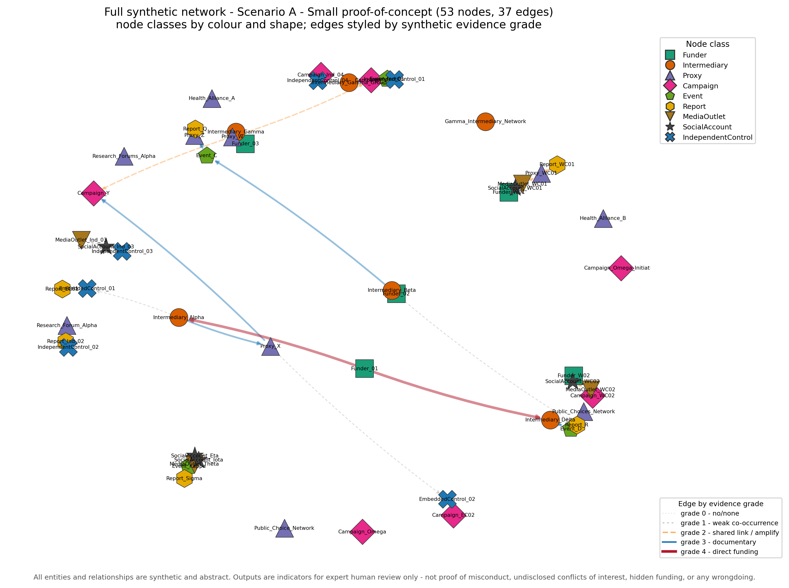
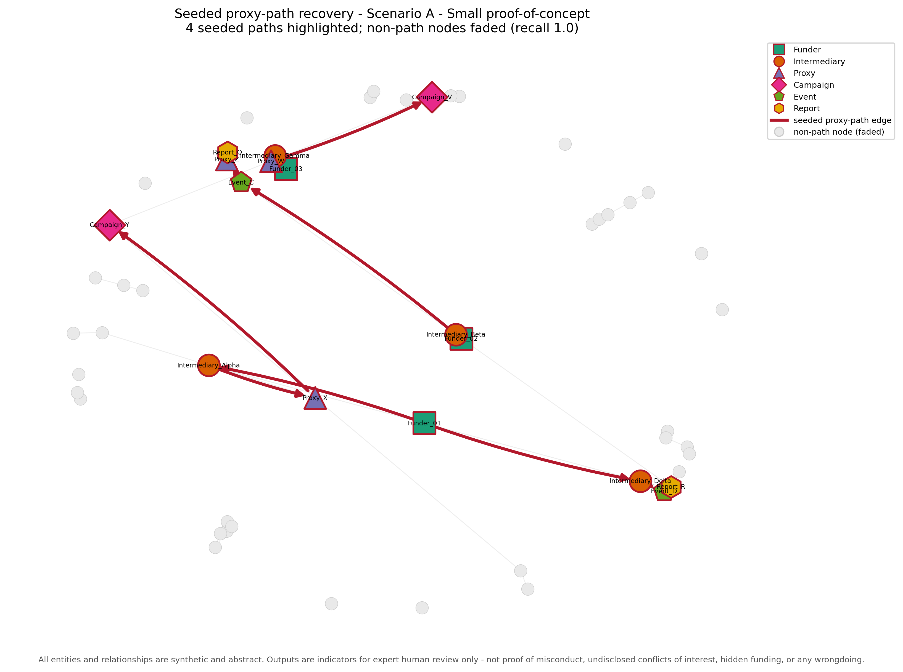
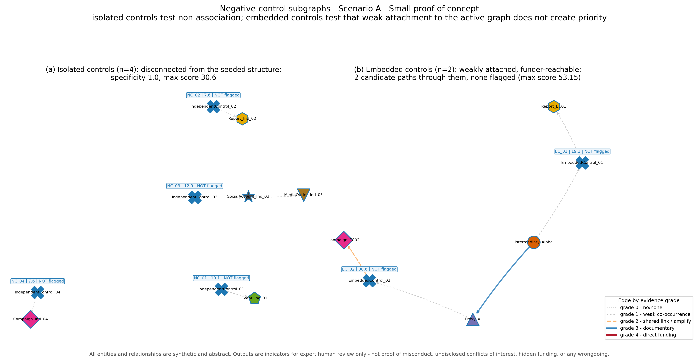
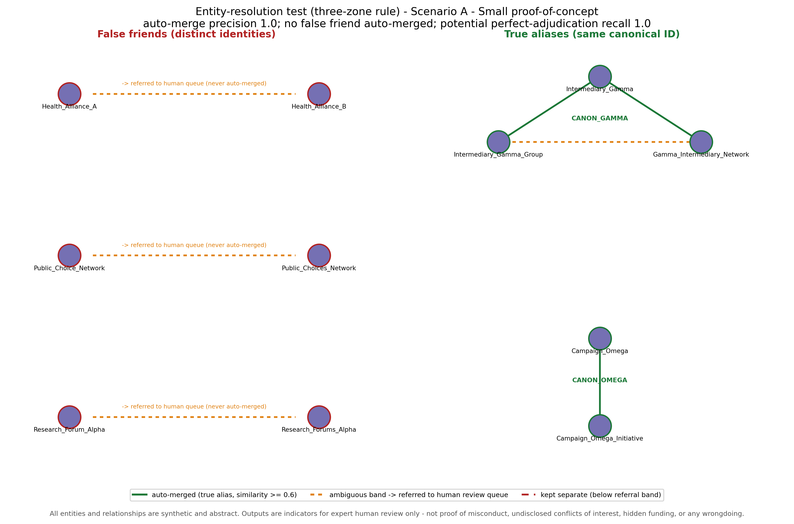
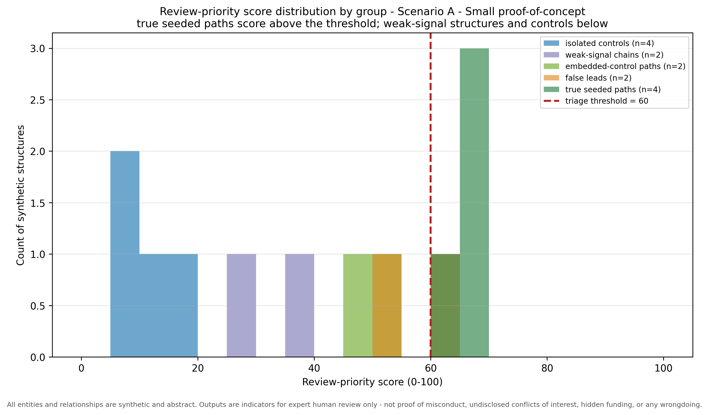
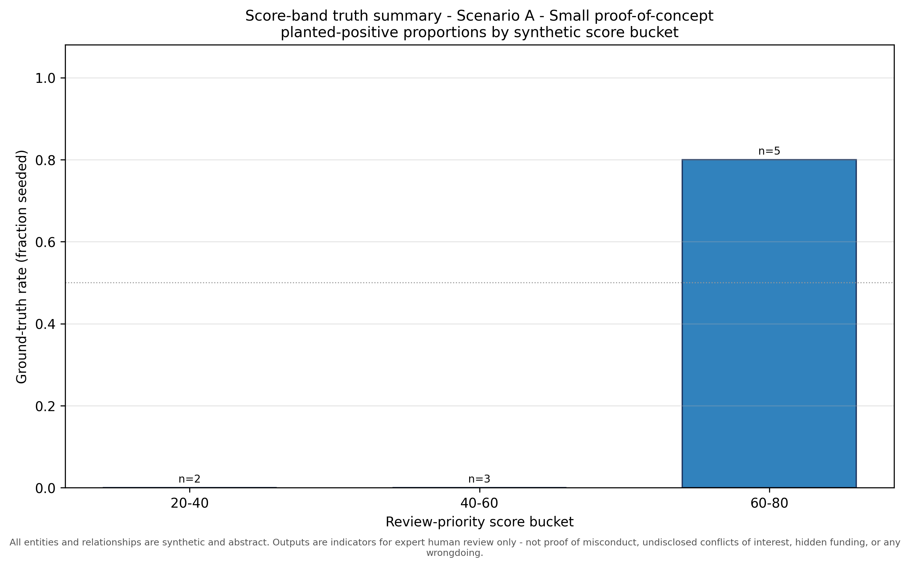
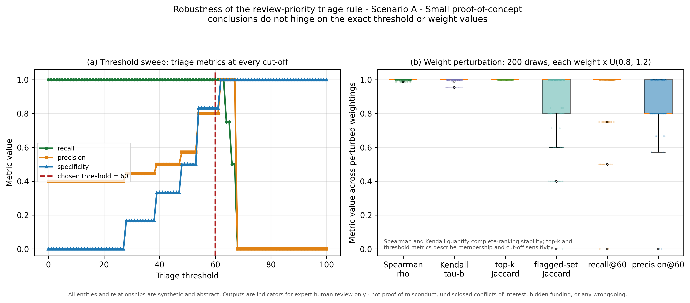

# Validation Tracking Report - Scenario A - Small proof-of-concept

_Synthetic validation harness (seed = 42)._

**All entities and relationships are synthetic and abstract. Outputs are indicators for expert human review only - not proof of misconduct, undisclosed conflicts of interest, hidden funding, or any wrongdoing.**

## 1. Network summary

| Quantity | Value |
| --- | --- |
| Total nodes | 53 |
| Total edges | 37 |
| Node classes | 9 |
| Relationship types | 11 |
| Seeded proxy paths | 4 |
| Candidate paths | 10 |
| False-friend entities | 6 |
| True-alias groups | 2 |
| Negative-control subgraphs (isolated + embedded) | 6 |
| Weak-signal chains (RQ5) | 2 |

**Triage threshold (review-priority cut-off): 60.0 / 100.** Scores are triage indicators for expert review only.

## 2. Seeded ground-truth proxy paths (answer key)

| Path ID | Node sequence | Relationship types | Grades |
| --- | --- | --- | --- |
| GT_PATH_01 | Funder_01 -> Intermediary_Alpha -> Proxy_X -> Campaign_Y | funds -> partners_with -> hosts | 4 -> 3 -> 3 |
| GT_PATH_02 | Funder_02 -> Intermediary_Beta -> Event_C -> Proxy_Z -> Report_Q | funds -> hosts -> speaks_at -> publishes | 4 -> 3 -> 3 -> 3 |
| GT_PATH_03 | Funder_03 -> Intermediary_Gamma -> Proxy_W -> Campaign_V | funds -> partners_with -> amplifies | 4 -> 3 -> 2 |
| GT_PATH_04 | Funder_01 -> Intermediary_Delta -> Event_D -> Report_R | funds -> hosts -> publishes | 4 -> 3 -> 3 |

## 3. Recovered candidate paths (flagged true positives)

| ID | Node sequence | Score |
| --- | --- | --- |
| GT_PATH_01 | Funder_01 -> Intermediary_Alpha -> Proxy_X -> Campaign_Y | 67.80 |
| GT_PATH_04 | Funder_01 -> Intermediary_Delta -> Event_D -> Report_R | 67.80 |
| GT_PATH_02 | Funder_02 -> Intermediary_Beta -> Event_C -> Proxy_Z -> Report_Q | 65.78 |
| GT_PATH_03 | Funder_03 -> Intermediary_Gamma -> Proxy_W -> Campaign_V | 63.80 |

Path-recovery recall **1.0**; precision **0.8**.

## 4. Missed paths (seeded but not flagged)

None - all seeded proxy paths were recovered.

## 5. False-positive paths (flagged but not seeded)

| Candidate ID | Node sequence | Score |
| --- | --- | --- |
| CAND_0008 | Funder_03 -> Intermediary_Gamma -> Proxy_W -> Campaign_Y | 61.30 |

These are passed to a human reviewer as possible leads only. 1 contain a weak (grade <= 2) hop that inspection may set aside; 0 consist entirely of documentary-grade (>= 3) hops and are not separable from true pathways on grades alone, so they require full manual verification.

## 6. Negative-control results (isolated and embedded)

| Control ID | Type | Nodes | Score | Outcome | Explanation |
| --- | --- | --- | --- | --- | --- |
| NC_01 | isolated | IndependentControl_01; Event_Ind_01 | 19.10 | NOT flagged | score 19.10 is below the threshold of 60.0; this isolated control (disconnected from the seeded structure) is correctly not flagged |
| NC_02 | isolated | IndependentControl_02; Report_Ind_02 | 7.60 | NOT flagged | score 7.60 is below the threshold of 60.0; this isolated control (disconnected from the seeded structure) is correctly not flagged |
| NC_03 | isolated | IndependentControl_03; SocialAccount_Ind_03; MediaOutlet_Ind_03 | 12.95 | NOT flagged | score 12.95 is below the threshold of 60.0; this isolated control (disconnected from the seeded structure) is correctly not flagged |
| NC_04 | isolated | IndependentControl_04; Campaign_Ind_04 | 7.60 | NOT flagged | score 7.60 is below the threshold of 60.0; this isolated control (disconnected from the seeded structure) is correctly not flagged |
| EC_01 | embedded | EmbeddedControl_01; Report_EC01 | 19.10 | NOT flagged | score 19.10 is below the threshold of 60.0; this embedded control (weakly attached to the active graph, reachable from a funder) is correctly not flagged |
| EC_02 | embedded | EmbeddedControl_02; Campaign_EC02 | 30.60 | NOT flagged | score 30.60 is below the threshold of 60.0; this embedded control (weakly attached to the active graph, reachable from a funder) is correctly not flagged |

Isolated-control specificity **1.0**; highest control score **30.6**. Embedded-control specificity **1.0** over 2 funder-reachable candidate paths through embedded controls (max candidate score **53.15**).

## 7. Entity-resolution decisions (three-zone rule)

Decisions: auto_merge (similarity >= 0.6), refer_to_human (0.4-0.6), keep_separate (< 0.4). The automated rule never merges in the ambiguous band; referred pairs go to the human review queue.

| Surface A | Surface B | Pair type | Sim. | Zone | Outcome |
| --- | --- | --- | --- | --- | --- |
| Health_Alliance_A | Health_Alliance_B | false_friend | 0.50 | refer_to_human | referred_distinct_pair |
| Public_Choice_Network | Public_Choices_Network | false_friend | 0.50 | refer_to_human | referred_distinct_pair |
| Research_Forum_Alpha | Research_Forums_Alpha | false_friend | 0.50 | refer_to_human | referred_distinct_pair |
| Intermediary_Gamma | Intermediary_Gamma_Group | true_alias | 0.67 | auto_merge | correct_auto_merge |
| Intermediary_Gamma | Gamma_Intermediary_Network | true_alias | 0.67 | auto_merge | correct_auto_merge |
| Campaign_Omega | Campaign_Omega_Initiative | true_alias | 0.67 | auto_merge | correct_auto_merge |
| Intermediary_Gamma_Group | Gamma_Intermediary_Network | true_alias | 0.50 | refer_to_human | referred_true_alias |

Auto-merge precision **1.0**; auto-merge recall **0.75**; potential recall if all referred true-alias pairs are correctly confirmed **1.0** (assumption, not observed human performance). False merges: **0**. Referral queue: 4 pairs (1 true aliases, 3 distinct pairs).

## 7b. Robustness checks (weak-signal chains, gate ablation, sensitivity)

| Robustness check | Value |
| --- | --- |
| Seeded weak-signal chains | 2 |
| Weak-chain candidate paths | 2 |
| Weak-chain candidates entering high-priority review | 0 |
| Weak-chain candidates flagged (gate REMOVED) | 0 |
| Max weak-chain score (gated) | 38.3 |
| Max weak-chain score (gate removed) | 42.8 |
| Max attainable weak-signal-only score (exact controlled-vocabulary enumeration, gate removed) | 44.8 |

Weight-perturbation stability (200 draws, +/-20%): Spearman rho min/median **0.9878 / 1.0**; Kendall tau-b min/median **0.9545 / 1.0**; top-k Jaccard min **1.0**; threshold-based recall median **1.0**. Ties use average ranks for Spearman and tau-b correction for Kendall. See sensitivity_analysis.csv and threshold_sweep.csv.

## 8. Path-by-path audit trail

Each candidate path is shown with its edge provenance, evidence snippets, triage decision and a recommended human-review action. Scores are triage indicators only.

### GT_PATH_01 (true_positive)

- **Node sequence:** Funder_01 -> Intermediary_Alpha -> Proxy_X -> Campaign_Y

- **Edge sequence:** funds -> partners_with -> hosts

- **Evidence grades:** 4 -> 3 -> 3

- **Edge provenance:** ground-truth -> ground-truth -> ground-truth

- **Evidence snippets:** Synthetic record: Funder_01 is listed as providing funding to Intermediary_Alpha during Phase_01. || Synthetic record: Intermediary_Alpha is described as a partner of Proxy_X during Phase_01. || Synthetic record: Proxy_X is listed as a host of Campaign_Y during Phase_02.

- **Review-priority score:** 67.8 (threshold 60.0) -> FLAGGED

- **Ground-truth label:** seeded proxy path

- **Why:** HIGH-PRIORITY REVIEW (raw score 67.80 >= threshold 60.0 and eligible): includes a direct synthetic funding edge (grade 4); weakest hop grade 3, mean grade 3.33; documentary continuity maintained across all hops.

- **Recommended action:** Prioritise for expert review: inspect the underlying synthetic records and confirm each link independently before drawing any inference.

### GT_PATH_04 (true_positive)

- **Node sequence:** Funder_01 -> Intermediary_Delta -> Event_D -> Report_R

- **Edge sequence:** funds -> hosts -> publishes

- **Evidence grades:** 4 -> 3 -> 3

- **Edge provenance:** ground-truth -> ground-truth -> ground-truth

- **Evidence snippets:** Synthetic record: Funder_01 is listed as providing funding to Intermediary_Delta during Phase_01. || Synthetic record: Intermediary_Delta is listed as a host of Event_D during Phase_01. || Synthetic record: Event_D is listed as the publisher of Report_R during Phase_02.

- **Review-priority score:** 67.8 (threshold 60.0) -> FLAGGED

- **Ground-truth label:** seeded proxy path

- **Why:** HIGH-PRIORITY REVIEW (raw score 67.80 >= threshold 60.0 and eligible): includes a direct synthetic funding edge (grade 4); weakest hop grade 3, mean grade 3.33; documentary continuity maintained across all hops.

- **Recommended action:** Prioritise for expert review: inspect the underlying synthetic records and confirm each link independently before drawing any inference.

### GT_PATH_02 (true_positive)

- **Node sequence:** Funder_02 -> Intermediary_Beta -> Event_C -> Proxy_Z -> Report_Q

- **Edge sequence:** funds -> hosts -> speaks_at -> publishes

- **Evidence grades:** 4 -> 3 -> 3 -> 3

- **Edge provenance:** ground-truth -> ground-truth -> ground-truth -> ground-truth

- **Evidence snippets:** Synthetic record: Funder_02 is listed as providing funding to Intermediary_Beta during Phase_01. || Synthetic record: Intermediary_Beta is listed as a host of Event_C during Phase_01. || Synthetic record: a representative of Event_C is listed as speaking at Proxy_Z during Phase_02. || Synthetic record: Proxy_Z is listed as the publisher of Report_Q during Phase_02.

- **Review-priority score:** 65.78 (threshold 60.0) -> FLAGGED

- **Ground-truth label:** seeded proxy path

- **Why:** HIGH-PRIORITY REVIEW (raw score 65.78 >= threshold 60.0 and eligible): includes a direct synthetic funding edge (grade 4); weakest hop grade 3, mean grade 3.25; documentary continuity maintained across all hops.

- **Recommended action:** Prioritise for expert review: inspect the underlying synthetic records and confirm each link independently before drawing any inference.

### GT_PATH_03 (true_positive)

- **Node sequence:** Funder_03 -> Intermediary_Gamma -> Proxy_W -> Campaign_V

- **Edge sequence:** funds -> partners_with -> amplifies

- **Evidence grades:** 4 -> 3 -> 2

- **Edge provenance:** ground-truth -> ground-truth -> ground-truth

- **Evidence snippets:** Synthetic record: Funder_03 is listed as providing funding to Intermediary_Gamma during Phase_01. || Synthetic record: Intermediary_Gamma is described as a partner of Proxy_W during Phase_01. || Synthetic record: Proxy_W repeatedly amplified output attributed to Campaign_V during Phase_02.

- **Review-priority score:** 63.8 (threshold 60.0) -> FLAGGED

- **Ground-truth label:** seeded proxy path

- **Why:** HIGH-PRIORITY REVIEW (raw score 63.80 >= threshold 60.0 and eligible): includes a direct synthetic funding edge (grade 4); weakest hop grade 2, mean grade 3.00; drops to a grade-2 shared-link/amplification hop.

- **Recommended action:** Prioritise for expert review: inspect the underlying synthetic records and confirm each link independently before drawing any inference.

### CAND_0008 (false_positive)

- **Node sequence:** Funder_03 -> Intermediary_Gamma -> Proxy_W -> Campaign_Y

- **Edge sequence:** funds -> partners_with -> shares_link

- **Evidence grades:** 4 -> 3 -> 2

- **Edge provenance:** ground-truth -> ground-truth -> distractor

- **Evidence snippets:** Synthetic record: Funder_03 is listed as providing funding to Intermediary_Gamma during Phase_01. || Synthetic record: Intermediary_Gamma is described as a partner of Proxy_W during Phase_01. || Synthetic record: Proxy_W and Campaign_Y shared the same abstract link during Phase_03.

- **Review-priority score:** 61.3 (threshold 60.0) -> FLAGGED

- **Ground-truth label:** not seeded

- **Why:** HIGH-PRIORITY REVIEW (raw score 61.30 >= threshold 60.0 and eligible): includes a direct synthetic funding edge (grade 4); weakest hop grade 2, mean grade 3.00; drops to a grade-2 shared-link/amplification hop.

- **Recommended action:** Queue for expert review as a possible lead only; the weakest hop is low grade (grade 2), so it may be set aside on inspection of that hop.

### CAND_0005 (true_negative)

- **Node sequence:** Funder_02 -> Intermediary_Beta -> Report_R

- **Edge sequence:** funds -> co_occurs_with

- **Evidence grades:** 4 -> 1

- **Edge provenance:** ground-truth -> distractor

- **Evidence snippets:** Synthetic record: Funder_02 is listed as providing funding to Intermediary_Beta during Phase_01. || Synthetic record: Intermediary_Beta and Report_R co-occurred in one abstract index during Phase_01.

- **Review-priority score:** 53.95 (threshold 60.0) -> not flagged

- **Ground-truth label:** not seeded

- **Why:** not high priority: raw score 53.95 is below threshold 60.0: includes a direct synthetic funding edge (grade 4); weakest hop grade 1, mean grade 2.50; drops to a grade-0/1 hop and is ineligible for high-priority review.

- **Recommended action:** No review action required; retain in the audit log for completeness.

### CAND_0003 (true_negative)

- **Node sequence:** Funder_01 -> Intermediary_Alpha -> Proxy_X -> EmbeddedControl_02 -> Campaign_EC02

- **Edge sequence:** funds -> partners_with -> co_occurs_with -> shares_link

- **Evidence grades:** 4 -> 3 -> 1 -> 2

- **Edge provenance:** ground-truth -> ground-truth -> negative-control -> negative-control

- **Evidence snippets:** Synthetic record: Funder_01 is listed as providing funding to Intermediary_Alpha during Phase_01. || Synthetic record: Intermediary_Alpha is described as a partner of Proxy_X during Phase_01. || Synthetic record: Proxy_X and EmbeddedControl_02 co-occurred in one abstract index during Phase_02. || Synthetic record: EmbeddedControl_02 and Campaign_EC02 shared the same abstract link during Phase_03.

- **Review-priority score:** 53.15 (threshold 60.0) -> not flagged

- **Ground-truth label:** not seeded

- **Why:** not high priority: raw score 53.15 is below threshold 60.0: includes a direct synthetic funding edge (grade 4); weakest hop grade 1, mean grade 2.50; drops to a grade-0/1 hop and is ineligible for high-priority review; passes through an embedded control actor connected only by weak co-occurrence.

- **Recommended action:** No review action required; retain in the audit log for completeness.

### CAND_0001 (true_negative)

- **Node sequence:** Funder_01 -> Intermediary_Alpha -> EmbeddedControl_01 -> Report_EC01

- **Edge sequence:** funds -> co_occurs_with -> co_occurs_with

- **Evidence grades:** 4 -> 1 -> 1

- **Edge provenance:** ground-truth -> negative-control -> negative-control

- **Evidence snippets:** Synthetic record: Funder_01 is listed as providing funding to Intermediary_Alpha during Phase_01. || Synthetic record: Intermediary_Alpha and EmbeddedControl_01 co-occurred in one abstract index during Phase_02. || Synthetic record: EmbeddedControl_01 and Report_EC01 co-occurred in one abstract index during Phase_03.

- **Review-priority score:** 47.2 (threshold 60.0) -> not flagged

- **Ground-truth label:** not seeded

- **Why:** not high priority: raw score 47.20 is below threshold 60.0: includes a direct synthetic funding edge (grade 4); weakest hop grade 1, mean grade 2.00; drops to a grade-0/1 hop and is ineligible for high-priority review; passes through an embedded control actor connected only by weak co-occurrence.

- **Recommended action:** No review action required; retain in the audit log for completeness.

### CAND_0010 (true_negative)

- **Node sequence:** Funder_W02 -> SocialAccount_WC02 -> MediaOutlet_WC02 -> Campaign_WC02

- **Edge sequence:** shares_link -> amplifies -> uses_similar_language

- **Evidence grades:** 2 -> 2 -> 2

- **Edge provenance:** distractor -> distractor -> distractor

- **Evidence snippets:** Synthetic record: Funder_W02 and SocialAccount_WC02 shared the same abstract link during Phase_01. || Synthetic record: SocialAccount_WC02 repeatedly amplified output attributed to MediaOutlet_WC02 during Phase_01. || Synthetic record: MediaOutlet_WC02 used wording closely similar to Campaign_WC02 during Phase_01.

- **Review-priority score:** 38.3 (threshold 60.0) -> not flagged

- **Ground-truth label:** not seeded

- **Why:** not high priority: raw score 38.30 is below threshold 60.0: no direct funding edge; weakest hop grade 2, mean grade 2.00; drops to a grade-2 shared-link/amplification hop; weak-signal-only chain (RQ5): no documentary hop anywhere.

- **Recommended action:** No review action required; retain in the audit log for completeness.

### CAND_0009 (true_negative)

- **Node sequence:** Funder_W01 -> SocialAccount_WC01 -> MediaOutlet_WC01 -> Proxy_WC01 -> Report_WC01

- **Edge sequence:** co_occurs_with -> shares_link -> amplifies -> uses_similar_language

- **Evidence grades:** 1 -> 2 -> 2 -> 2

- **Edge provenance:** distractor -> distractor -> distractor -> distractor

- **Evidence snippets:** Synthetic record: Funder_W01 and SocialAccount_WC01 co-occurred in one abstract index during Phase_01. || Synthetic record: SocialAccount_WC01 and MediaOutlet_WC01 shared the same abstract link during Phase_01. || Synthetic record: MediaOutlet_WC01 repeatedly amplified output attributed to Proxy_WC01 during Phase_02. || Synthetic record: Proxy_WC01 used wording closely similar to Report_WC01 during Phase_02.

- **Review-priority score:** 27.77 (threshold 60.0) -> not flagged

- **Ground-truth label:** not seeded

- **Why:** not high priority: raw score 27.77 is below threshold 60.0: no direct funding edge; weakest hop grade 1, mean grade 1.75; drops to a grade-0/1 hop and is ineligible for high-priority review; weak-signal-only chain (RQ5): no documentary hop anywhere.

- **Recommended action:** No review action required; retain in the audit log for completeness.

## 9. Visual validation

## 10. Interpretation statement

This report is a transparent, path-by-path audit trail. The framework is designed to prioritise manual expert review, not to automate accusation or attribution. **All entities and relationships are synthetic and abstract. Outputs are indicators for expert human review only - not proof of misconduct, undisclosed conflicts of interest, hidden funding, or any wrongdoing.**