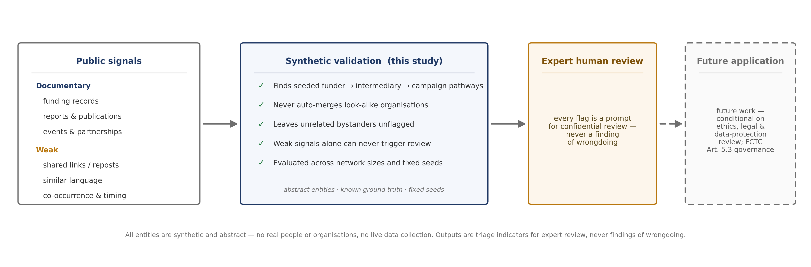
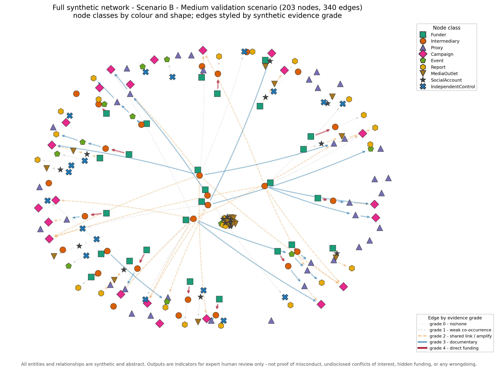
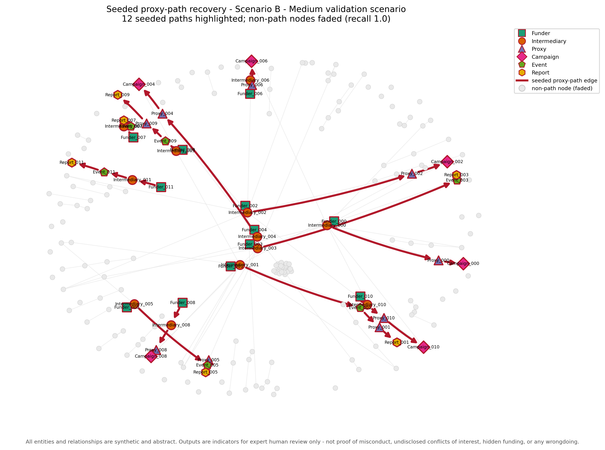
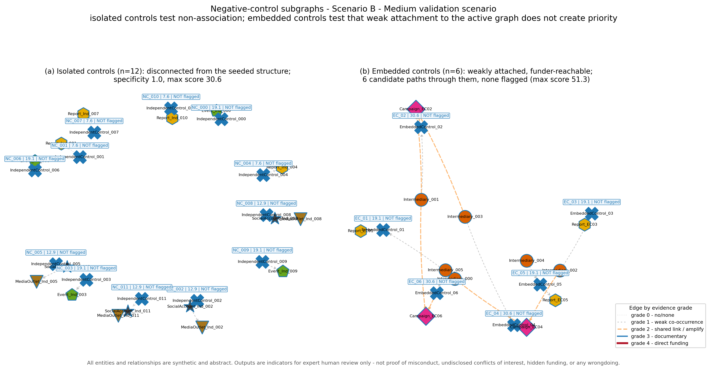
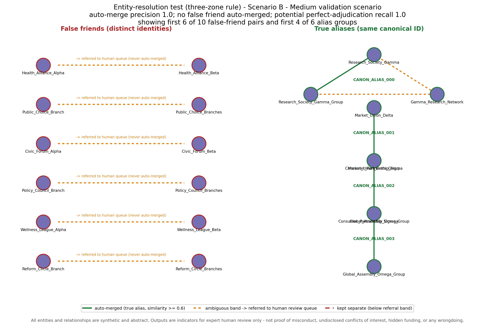
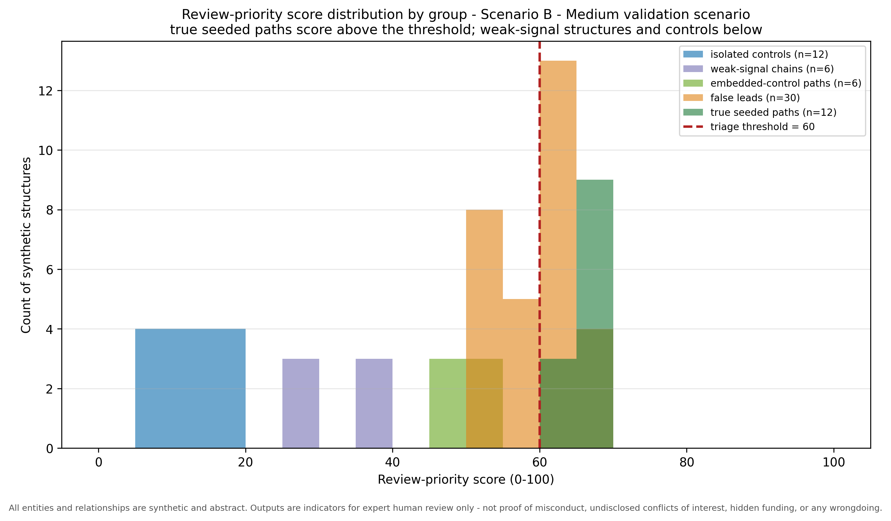
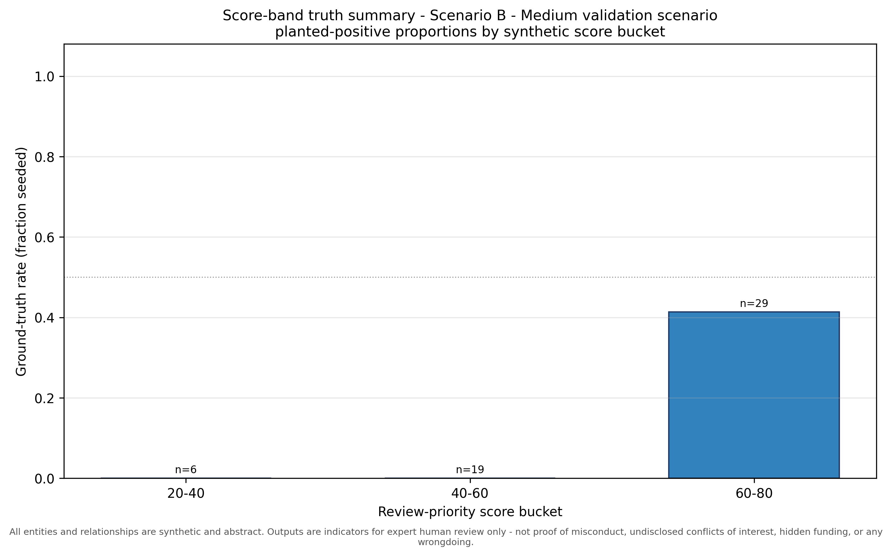
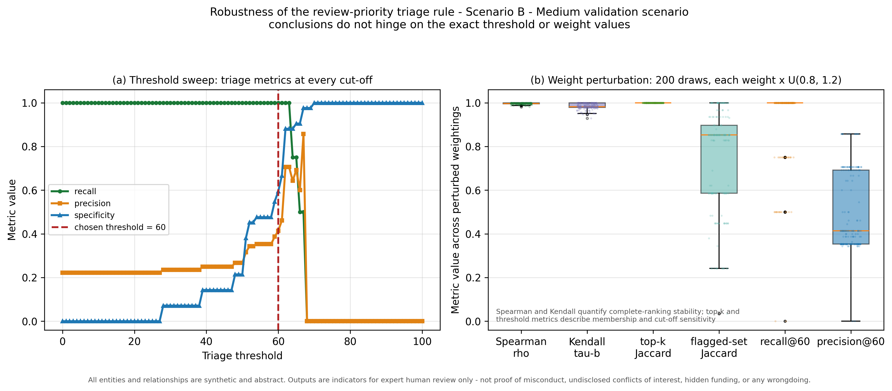

# Validation Tracking Report - Scenario B - Medium validation scenario

_Synthetic validation harness (seed = 142)._

**All entities and relationships are synthetic and abstract. Outputs are indicators for expert human review only - not proof of misconduct, undisclosed conflicts of interest, hidden funding, or any wrongdoing.**

## 1. Network summary

| Quantity | Value |
| --- | --- |
| Total nodes | 203 |
| Total edges | 340 |
| Node classes | 9 |
| Relationship types | 10 |
| Seeded proxy paths | 12 |
| Candidate paths | 54 |
| False-friend entities | 20 |
| True-alias groups | 6 |
| Negative-control subgraphs (isolated + embedded) | 18 |
| Weak-signal chains (RQ5) | 6 |

**Triage threshold (review-priority cut-off): 60.0 / 100.** Scores are triage indicators for expert review only.

## 2. Seeded ground-truth proxy paths (answer key)

| Path ID | Node sequence | Relationship types | Grades |
| --- | --- | --- | --- |
| GT_PATH_000 | Funder_000 -> Intermediary_000 -> Proxy_000 -> Campaign_000 | funds -> partners_with -> hosts | 4 -> 3 -> 3 |
| GT_PATH_001 | Funder_001 -> Intermediary_001 -> Event_001 -> Proxy_001 -> Report_001 | funds -> hosts -> speaks_at -> publishes | 4 -> 3 -> 3 -> 3 |
| GT_PATH_002 | Funder_002 -> Intermediary_002 -> Proxy_002 -> Campaign_002 | funds -> partners_with -> amplifies | 4 -> 3 -> 2 |
| GT_PATH_003 | Funder_003 -> Intermediary_003 -> Event_003 -> Report_003 | funds -> hosts -> publishes | 4 -> 3 -> 3 |
| GT_PATH_004 | Funder_004 -> Intermediary_004 -> Proxy_004 -> Campaign_004 | funds -> partners_with -> hosts | 4 -> 3 -> 3 |
| GT_PATH_005 | Funder_005 -> Intermediary_005 -> Event_005 -> Proxy_005 -> Report_005 | funds -> hosts -> speaks_at -> publishes | 4 -> 3 -> 3 -> 3 |
| GT_PATH_006 | Funder_006 -> Intermediary_006 -> Proxy_006 -> Campaign_006 | funds -> partners_with -> amplifies | 4 -> 3 -> 2 |
| GT_PATH_007 | Funder_007 -> Intermediary_007 -> Event_007 -> Report_007 | funds -> hosts -> publishes | 4 -> 3 -> 3 |
| GT_PATH_008 | Funder_008 -> Intermediary_008 -> Proxy_008 -> Campaign_008 | funds -> partners_with -> hosts | 4 -> 3 -> 3 |
| GT_PATH_009 | Funder_009 -> Intermediary_009 -> Event_009 -> Proxy_009 -> Report_009 | funds -> hosts -> speaks_at -> publishes | 4 -> 3 -> 3 -> 3 |
| GT_PATH_010 | Funder_010 -> Intermediary_010 -> Proxy_010 -> Campaign_010 | funds -> partners_with -> amplifies | 4 -> 3 -> 2 |
| GT_PATH_011 | Funder_011 -> Intermediary_011 -> Event_011 -> Report_011 | funds -> hosts -> publishes | 4 -> 3 -> 3 |

## 3. Recovered candidate paths (flagged true positives)

| ID | Node sequence | Score |
| --- | --- | --- |
| GT_PATH_000 | Funder_000 -> Intermediary_000 -> Proxy_000 -> Campaign_000 | 67.80 |
| GT_PATH_004 | Funder_004 -> Intermediary_004 -> Proxy_004 -> Campaign_004 | 67.80 |
| GT_PATH_007 | Funder_007 -> Intermediary_007 -> Event_007 -> Report_007 | 67.80 |
| GT_PATH_008 | Funder_008 -> Intermediary_008 -> Proxy_008 -> Campaign_008 | 67.80 |
| GT_PATH_003 | Funder_003 -> Intermediary_003 -> Event_003 -> Report_003 | 67.80 |
| GT_PATH_011 | Funder_011 -> Intermediary_011 -> Event_011 -> Report_011 | 67.80 |
| GT_PATH_005 | Funder_005 -> Intermediary_005 -> Event_005 -> Proxy_005 -> Report_005 | 65.78 |
| GT_PATH_009 | Funder_009 -> Intermediary_009 -> Event_009 -> Proxy_009 -> Report_009 | 65.78 |
| GT_PATH_001 | Funder_001 -> Intermediary_001 -> Event_001 -> Proxy_001 -> Report_001 | 65.78 |
| GT_PATH_002 | Funder_002 -> Intermediary_002 -> Proxy_002 -> Campaign_002 | 63.80 |
| GT_PATH_010 | Funder_010 -> Intermediary_010 -> Proxy_010 -> Campaign_010 | 63.80 |
| GT_PATH_006 | Funder_006 -> Intermediary_006 -> Proxy_006 -> Campaign_006 | 63.80 |

Path-recovery recall **1.0**; precision **0.4138**.

## 4. Missed paths (seeded but not flagged)

None - all seeded proxy paths were recovered.

## 5. False-positive paths (flagged but not seeded)

| Candidate ID | Node sequence | Score |
| --- | --- | --- |
| CAND_0013 | Funder_001 -> Intermediary_001 -> Campaign_L007 | 69.45 |
| CAND_0018 | Funder_002 -> Intermediary_002 -> Campaign_WC02 | 66.45 |
| CAND_0025 | Funder_003 -> Intermediary_003 -> Campaign_WC04 | 66.45 |
| CAND_0004 | Funder_000 -> Intermediary_000 -> Campaign_L005 | 66.45 |
| CAND_0014 | Funder_001 -> Intermediary_001 -> Campaign_EC06 | 64.20 |
| CAND_0016 | Funder_001 -> Intermediary_001 -> Campaign_008 | 61.70 |
| CAND_0042 | Funder_L001 -> Intermediary_L001 -> Proxy_L001 -> Campaign_L001 | 61.30 |
| CAND_0028 | Funder_003 -> Intermediary_003 -> Proxy_005 -> Report_005 | 61.30 |
| CAND_0019 | Funder_002 -> Intermediary_002 -> Proxy_004 -> Campaign_004 | 61.30 |
| CAND_0044 | Funder_L003 -> Intermediary_L003 -> Proxy_L003 -> Campaign_L003 | 61.30 |
| CAND_0048 | Funder_L007 -> Intermediary_L007 -> Proxy_L007 -> Campaign_L007 | 61.30 |
| CAND_0046 | Funder_L005 -> Intermediary_L005 -> Proxy_L005 -> Campaign_L005 | 61.30 |
| CAND_0003 | Funder_000 -> Intermediary_000 -> Campaign_EC04 | 61.20 |
| CAND_0022 | Funder_002 -> Intermediary_002 -> Campaign_L001 | 61.20 |
| CAND_0008 | Funder_000 -> Intermediary_000 -> Campaign_010 | 60.70 |
| CAND_0012 | Funder_001 -> Intermediary_001 -> Campaign_EC02 | 60.70 |
| CAND_0024 | Funder_002 -> Intermediary_002 -> Campaign_EC04 | 60.70 |

These are passed to a human reviewer as possible leads only. 13 contain a weak (grade <= 2) hop that inspection may set aside; 4 consist entirely of documentary-grade (>= 3) hops and are not separable from true pathways on grades alone, so they require full manual verification.

## 6. Negative-control results (isolated and embedded)

| Control ID | Type | Nodes | Score | Outcome | Explanation |
| --- | --- | --- | --- | --- | --- |
| NC_000 | isolated | IndependentControl_000; Event_Ind_000 | 19.10 | NOT flagged | score 19.10 is below the threshold of 60.0; this isolated control (disconnected from the seeded structure) is correctly not flagged |
| NC_001 | isolated | IndependentControl_001; Report_Ind_001 | 7.60 | NOT flagged | score 7.60 is below the threshold of 60.0; this isolated control (disconnected from the seeded structure) is correctly not flagged |
| NC_002 | isolated | IndependentControl_002; SocialAccount_Ind_002; MediaOutlet_Ind_002 | 12.95 | NOT flagged | score 12.95 is below the threshold of 60.0; this isolated control (disconnected from the seeded structure) is correctly not flagged |
| NC_003 | isolated | IndependentControl_003; Event_Ind_003 | 19.10 | NOT flagged | score 19.10 is below the threshold of 60.0; this isolated control (disconnected from the seeded structure) is correctly not flagged |
| NC_004 | isolated | IndependentControl_004; Report_Ind_004 | 7.60 | NOT flagged | score 7.60 is below the threshold of 60.0; this isolated control (disconnected from the seeded structure) is correctly not flagged |
| NC_005 | isolated | IndependentControl_005; SocialAccount_Ind_005; MediaOutlet_Ind_005 | 12.95 | NOT flagged | score 12.95 is below the threshold of 60.0; this isolated control (disconnected from the seeded structure) is correctly not flagged |
| NC_006 | isolated | IndependentControl_006; Event_Ind_006 | 19.10 | NOT flagged | score 19.10 is below the threshold of 60.0; this isolated control (disconnected from the seeded structure) is correctly not flagged |
| NC_007 | isolated | IndependentControl_007; Report_Ind_007 | 7.60 | NOT flagged | score 7.60 is below the threshold of 60.0; this isolated control (disconnected from the seeded structure) is correctly not flagged |
| NC_008 | isolated | IndependentControl_008; SocialAccount_Ind_008; MediaOutlet_Ind_008 | 12.95 | NOT flagged | score 12.95 is below the threshold of 60.0; this isolated control (disconnected from the seeded structure) is correctly not flagged |
| NC_009 | isolated | IndependentControl_009; Event_Ind_009 | 19.10 | NOT flagged | score 19.10 is below the threshold of 60.0; this isolated control (disconnected from the seeded structure) is correctly not flagged |
| NC_010 | isolated | IndependentControl_010; Report_Ind_010 | 7.60 | NOT flagged | score 7.60 is below the threshold of 60.0; this isolated control (disconnected from the seeded structure) is correctly not flagged |
| NC_011 | isolated | IndependentControl_011; SocialAccount_Ind_011; MediaOutlet_Ind_011 | 12.95 | NOT flagged | score 12.95 is below the threshold of 60.0; this isolated control (disconnected from the seeded structure) is correctly not flagged |
| EC_01 | embedded | EmbeddedControl_01; Report_EC01 | 19.10 | NOT flagged | score 19.10 is below the threshold of 60.0; this embedded control (weakly attached to the active graph, reachable from a funder) is correctly not flagged |
| EC_02 | embedded | EmbeddedControl_02; Campaign_EC02 | 30.60 | NOT flagged | score 30.60 is below the threshold of 60.0; this embedded control (weakly attached to the active graph, reachable from a funder) is correctly not flagged |
| EC_03 | embedded | EmbeddedControl_03; Report_EC03 | 19.10 | NOT flagged | score 19.10 is below the threshold of 60.0; this embedded control (weakly attached to the active graph, reachable from a funder) is correctly not flagged |
| EC_04 | embedded | EmbeddedControl_04; Campaign_EC04 | 30.60 | NOT flagged | score 30.60 is below the threshold of 60.0; this embedded control (weakly attached to the active graph, reachable from a funder) is correctly not flagged |
| EC_05 | embedded | EmbeddedControl_05; Report_EC05 | 19.10 | NOT flagged | score 19.10 is below the threshold of 60.0; this embedded control (weakly attached to the active graph, reachable from a funder) is correctly not flagged |
| EC_06 | embedded | EmbeddedControl_06; Campaign_EC06 | 30.60 | NOT flagged | score 30.60 is below the threshold of 60.0; this embedded control (weakly attached to the active graph, reachable from a funder) is correctly not flagged |

Isolated-control specificity **1.0**; highest control score **30.6**. Embedded-control specificity **1.0** over 6 funder-reachable candidate paths through embedded controls (max candidate score **51.3**).

## 7. Entity-resolution decisions (three-zone rule)

Decisions: auto_merge (similarity >= 0.6), refer_to_human (0.4-0.6), keep_separate (< 0.4). The automated rule never merges in the ambiguous band; referred pairs go to the human review queue.

| Surface A | Surface B | Pair type | Sim. | Zone | Outcome |
| --- | --- | --- | --- | --- | --- |
| Health_Alliance_Alpha | Health_Alliance_Beta | false_friend | 0.50 | refer_to_human | referred_distinct_pair |
| Public_Choice_Branch | Public_Choice_Branches | false_friend | 0.50 | refer_to_human | referred_distinct_pair |
| Civic_Forum_Alpha | Civic_Forum_Beta | false_friend | 0.50 | refer_to_human | referred_distinct_pair |
| Policy_Council_Branch | Policy_Council_Branches | false_friend | 0.50 | refer_to_human | referred_distinct_pair |
| Wellness_League_Alpha | Wellness_League_Beta | false_friend | 0.50 | refer_to_human | referred_distinct_pair |
| Reform_Circle_Branch | Reform_Circle_Branches | false_friend | 0.50 | refer_to_human | referred_distinct_pair |
| Liberty_Board_Alpha | Liberty_Board_Beta | false_friend | 0.50 | refer_to_human | referred_distinct_pair |
| Standards_Coalition_Branch | Standards_Coalition_Branches | false_friend | 0.50 | refer_to_human | referred_distinct_pair |
| Data_Institute_Alpha | Data_Institute_Beta | false_friend | 0.50 | refer_to_human | referred_distinct_pair |
| Citizen_Trust_Branch | Citizen_Trust_Branches | false_friend | 0.50 | refer_to_human | referred_distinct_pair |
| Research_Society_Gamma | Research_Society_Gamma_Group | true_alias | 0.75 | auto_merge | correct_auto_merge |
| Market_Union_Delta | Market_Union_Delta_Group | true_alias | 0.75 | auto_merge | correct_auto_merge |
| Consumer_Partnership_Sigma | Consumer_Partnership_Sigma_Group | true_alias | 0.75 | auto_merge | correct_auto_merge |
| Global_Assembly_Omega | Global_Assembly_Omega_Group | true_alias | 0.75 | auto_merge | correct_auto_merge |
| Regional_Foundation_Theta | Regional_Foundation_Theta_Group | true_alias | 0.75 | auto_merge | correct_auto_merge |
| National_Choice_Lambda | National_Choice_Lambda_Group | true_alias | 0.75 | auto_merge | correct_auto_merge |
| Research_Society_Gamma | Gamma_Research_Network | true_alias | 0.50 | refer_to_human | referred_true_alias |
| Research_Society_Gamma_Group | Gamma_Research_Network | true_alias | 0.40 | refer_to_human | referred_true_alias |

Auto-merge precision **1.0**; auto-merge recall **0.75**; potential recall if all referred true-alias pairs are correctly confirmed **1.0** (assumption, not observed human performance). False merges: **0**. Referral queue: 12 pairs (2 true aliases, 10 distinct pairs).

## 7b. Robustness checks (weak-signal chains, gate ablation, sensitivity)

| Robustness check | Value |
| --- | --- |
| Seeded weak-signal chains | 6 |
| Weak-chain candidate paths | 6 |
| Weak-chain candidates entering high-priority review | 0 |
| Weak-chain candidates flagged (gate REMOVED) | 0 |
| Max weak-chain score (gated) | 38.3 |
| Max weak-chain score (gate removed) | 42.8 |
| Max attainable weak-signal-only score (exact controlled-vocabulary enumeration, gate removed) | 44.8 |

Weight-perturbation stability (200 draws, +/-20%): Spearman rho min/median **0.9812 / 0.9963**; Kendall tau-b min/median **0.9286 / 0.9819**; top-k Jaccard min **1.0**; threshold-based recall median **1.0**. Ties use average ranks for Spearman and tau-b correction for Kendall. See sensitivity_analysis.csv and threshold_sweep.csv.

## 7c. Connected active-network noise challenge

22 connected active-noise edges increased candidate-path enumeration from **32** to **54**. The scenario contained **22** candidate paths using active noise and **13** high-priority active-noise false positives. These false positives are retained as an adverse result; candidate enumeration did not reach the cap of 20000.

## 8. Path-by-path audit trail

Each candidate path is shown with its edge provenance, evidence snippets, triage decision and a recommended human-review action. Scores are triage indicators only.

### GT_PATH_000 (true_positive)

- **Node sequence:** Funder_000 -> Intermediary_000 -> Proxy_000 -> Campaign_000

- **Edge sequence:** funds -> partners_with -> hosts

- **Evidence grades:** 4 -> 3 -> 3

- **Edge provenance:** ground-truth -> ground-truth -> ground-truth

- **Evidence snippets:** Synthetic record: Funder_000 is listed as providing funding to Intermediary_000 during Phase_01. || Synthetic record: Intermediary_000 is described as a partner of Proxy_000 during Phase_01. || Synthetic record: Proxy_000 is listed as a host of Campaign_000 during Phase_02.

- **Review-priority score:** 67.8 (threshold 60.0) -> FLAGGED

- **Ground-truth label:** seeded proxy path

- **Why:** HIGH-PRIORITY REVIEW (raw score 67.80 >= threshold 60.0 and eligible): includes a direct synthetic funding edge (grade 4); weakest hop grade 3, mean grade 3.33; documentary continuity maintained across all hops.

- **Recommended action:** Prioritise for expert review: inspect the underlying synthetic records and confirm each link independently before drawing any inference.

### GT_PATH_004 (true_positive)

- **Node sequence:** Funder_004 -> Intermediary_004 -> Proxy_004 -> Campaign_004

- **Edge sequence:** funds -> partners_with -> hosts

- **Evidence grades:** 4 -> 3 -> 3

- **Edge provenance:** ground-truth -> ground-truth -> ground-truth

- **Evidence snippets:** Synthetic record: Funder_004 is listed as providing funding to Intermediary_004 during Phase_01. || Synthetic record: Intermediary_004 is described as a partner of Proxy_004 during Phase_01. || Synthetic record: Proxy_004 is listed as a host of Campaign_004 during Phase_02.

- **Review-priority score:** 67.8 (threshold 60.0) -> FLAGGED

- **Ground-truth label:** seeded proxy path

- **Why:** HIGH-PRIORITY REVIEW (raw score 67.80 >= threshold 60.0 and eligible): includes a direct synthetic funding edge (grade 4); weakest hop grade 3, mean grade 3.33; documentary continuity maintained across all hops.

- **Recommended action:** Prioritise for expert review: inspect the underlying synthetic records and confirm each link independently before drawing any inference.

### GT_PATH_007 (true_positive)

- **Node sequence:** Funder_007 -> Intermediary_007 -> Event_007 -> Report_007

- **Edge sequence:** funds -> hosts -> publishes

- **Evidence grades:** 4 -> 3 -> 3

- **Edge provenance:** ground-truth -> ground-truth -> ground-truth

- **Evidence snippets:** Synthetic record: Funder_007 is listed as providing funding to Intermediary_007 during Phase_01. || Synthetic record: Intermediary_007 is listed as a host of Event_007 during Phase_01. || Synthetic record: Event_007 is listed as the publisher of Report_007 during Phase_02.

- **Review-priority score:** 67.8 (threshold 60.0) -> FLAGGED

- **Ground-truth label:** seeded proxy path

- **Why:** HIGH-PRIORITY REVIEW (raw score 67.80 >= threshold 60.0 and eligible): includes a direct synthetic funding edge (grade 4); weakest hop grade 3, mean grade 3.33; documentary continuity maintained across all hops.

- **Recommended action:** Prioritise for expert review: inspect the underlying synthetic records and confirm each link independently before drawing any inference.

### GT_PATH_008 (true_positive)

- **Node sequence:** Funder_008 -> Intermediary_008 -> Proxy_008 -> Campaign_008

- **Edge sequence:** funds -> partners_with -> hosts

- **Evidence grades:** 4 -> 3 -> 3

- **Edge provenance:** ground-truth -> ground-truth -> ground-truth

- **Evidence snippets:** Synthetic record: Funder_008 is listed as providing funding to Intermediary_008 during Phase_01. || Synthetic record: Intermediary_008 is described as a partner of Proxy_008 during Phase_01. || Synthetic record: Proxy_008 is listed as a host of Campaign_008 during Phase_02.

- **Review-priority score:** 67.8 (threshold 60.0) -> FLAGGED

- **Ground-truth label:** seeded proxy path

- **Why:** HIGH-PRIORITY REVIEW (raw score 67.80 >= threshold 60.0 and eligible): includes a direct synthetic funding edge (grade 4); weakest hop grade 3, mean grade 3.33; documentary continuity maintained across all hops.

- **Recommended action:** Prioritise for expert review: inspect the underlying synthetic records and confirm each link independently before drawing any inference.

### GT_PATH_003 (true_positive)

- **Node sequence:** Funder_003 -> Intermediary_003 -> Event_003 -> Report_003

- **Edge sequence:** funds -> hosts -> publishes

- **Evidence grades:** 4 -> 3 -> 3

- **Edge provenance:** ground-truth -> ground-truth -> ground-truth

- **Evidence snippets:** Synthetic record: Funder_003 is listed as providing funding to Intermediary_003 during Phase_01. || Synthetic record: Intermediary_003 is listed as a host of Event_003 during Phase_01. || Synthetic record: Event_003 is listed as the publisher of Report_003 during Phase_02.

- **Review-priority score:** 67.8 (threshold 60.0) -> FLAGGED

- **Ground-truth label:** seeded proxy path

- **Why:** HIGH-PRIORITY REVIEW (raw score 67.80 >= threshold 60.0 and eligible): includes a direct synthetic funding edge (grade 4); weakest hop grade 3, mean grade 3.33; documentary continuity maintained across all hops.

- **Recommended action:** Prioritise for expert review: inspect the underlying synthetic records and confirm each link independently before drawing any inference.

### GT_PATH_011 (true_positive)

- **Node sequence:** Funder_011 -> Intermediary_011 -> Event_011 -> Report_011

- **Edge sequence:** funds -> hosts -> publishes

- **Evidence grades:** 4 -> 3 -> 3

- **Edge provenance:** ground-truth -> ground-truth -> ground-truth

- **Evidence snippets:** Synthetic record: Funder_011 is listed as providing funding to Intermediary_011 during Phase_01. || Synthetic record: Intermediary_011 is listed as a host of Event_011 during Phase_01. || Synthetic record: Event_011 is listed as the publisher of Report_011 during Phase_02.

- **Review-priority score:** 67.8 (threshold 60.0) -> FLAGGED

- **Ground-truth label:** seeded proxy path

- **Why:** HIGH-PRIORITY REVIEW (raw score 67.80 >= threshold 60.0 and eligible): includes a direct synthetic funding edge (grade 4); weakest hop grade 3, mean grade 3.33; documentary continuity maintained across all hops.

- **Recommended action:** Prioritise for expert review: inspect the underlying synthetic records and confirm each link independently before drawing any inference.

### GT_PATH_005 (true_positive)

- **Node sequence:** Funder_005 -> Intermediary_005 -> Event_005 -> Proxy_005 -> Report_005

- **Edge sequence:** funds -> hosts -> speaks_at -> publishes

- **Evidence grades:** 4 -> 3 -> 3 -> 3

- **Edge provenance:** ground-truth -> ground-truth -> ground-truth -> ground-truth

- **Evidence snippets:** Synthetic record: Funder_005 is listed as providing funding to Intermediary_005 during Phase_01. || Synthetic record: Intermediary_005 is listed as a host of Event_005 during Phase_01. || Synthetic record: a representative of Event_005 is listed as speaking at Proxy_005 during Phase_02. || Synthetic record: Proxy_005 is listed as the publisher of Report_005 during Phase_02.

- **Review-priority score:** 65.78 (threshold 60.0) -> FLAGGED

- **Ground-truth label:** seeded proxy path

- **Why:** HIGH-PRIORITY REVIEW (raw score 65.78 >= threshold 60.0 and eligible): includes a direct synthetic funding edge (grade 4); weakest hop grade 3, mean grade 3.25; documentary continuity maintained across all hops.

- **Recommended action:** Prioritise for expert review: inspect the underlying synthetic records and confirm each link independently before drawing any inference.

### GT_PATH_009 (true_positive)

- **Node sequence:** Funder_009 -> Intermediary_009 -> Event_009 -> Proxy_009 -> Report_009

- **Edge sequence:** funds -> hosts -> speaks_at -> publishes

- **Evidence grades:** 4 -> 3 -> 3 -> 3

- **Edge provenance:** ground-truth -> ground-truth -> ground-truth -> ground-truth

- **Evidence snippets:** Synthetic record: Funder_009 is listed as providing funding to Intermediary_009 during Phase_01. || Synthetic record: Intermediary_009 is listed as a host of Event_009 during Phase_01. || Synthetic record: a representative of Event_009 is listed as speaking at Proxy_009 during Phase_02. || Synthetic record: Proxy_009 is listed as the publisher of Report_009 during Phase_02.

- **Review-priority score:** 65.78 (threshold 60.0) -> FLAGGED

- **Ground-truth label:** seeded proxy path

- **Why:** HIGH-PRIORITY REVIEW (raw score 65.78 >= threshold 60.0 and eligible): includes a direct synthetic funding edge (grade 4); weakest hop grade 3, mean grade 3.25; documentary continuity maintained across all hops.

- **Recommended action:** Prioritise for expert review: inspect the underlying synthetic records and confirm each link independently before drawing any inference.

### GT_PATH_001 (true_positive)

- **Node sequence:** Funder_001 -> Intermediary_001 -> Event_001 -> Proxy_001 -> Report_001

- **Edge sequence:** funds -> hosts -> speaks_at -> publishes

- **Evidence grades:** 4 -> 3 -> 3 -> 3

- **Edge provenance:** ground-truth -> ground-truth -> ground-truth -> ground-truth

- **Evidence snippets:** Synthetic record: Funder_001 is listed as providing funding to Intermediary_001 during Phase_01. || Synthetic record: Intermediary_001 is listed as a host of Event_001 during Phase_01. || Synthetic record: a representative of Event_001 is listed as speaking at Proxy_001 during Phase_02. || Synthetic record: Proxy_001 is listed as the publisher of Report_001 during Phase_02.

- **Review-priority score:** 65.78 (threshold 60.0) -> FLAGGED

- **Ground-truth label:** seeded proxy path

- **Why:** HIGH-PRIORITY REVIEW (raw score 65.78 >= threshold 60.0 and eligible): includes a direct synthetic funding edge (grade 4); weakest hop grade 3, mean grade 3.25; documentary continuity maintained across all hops.

- **Recommended action:** Prioritise for expert review: inspect the underlying synthetic records and confirm each link independently before drawing any inference.

### GT_PATH_002 (true_positive)

- **Node sequence:** Funder_002 -> Intermediary_002 -> Proxy_002 -> Campaign_002

- **Edge sequence:** funds -> partners_with -> amplifies

- **Evidence grades:** 4 -> 3 -> 2

- **Edge provenance:** ground-truth -> ground-truth -> ground-truth

- **Evidence snippets:** Synthetic record: Funder_002 is listed as providing funding to Intermediary_002 during Phase_01. || Synthetic record: Intermediary_002 is described as a partner of Proxy_002 during Phase_01. || Synthetic record: Proxy_002 repeatedly amplified output attributed to Campaign_002 during Phase_02.

- **Review-priority score:** 63.8 (threshold 60.0) -> FLAGGED

- **Ground-truth label:** seeded proxy path

- **Why:** HIGH-PRIORITY REVIEW (raw score 63.80 >= threshold 60.0 and eligible): includes a direct synthetic funding edge (grade 4); weakest hop grade 2, mean grade 3.00; drops to a grade-2 shared-link/amplification hop.

- **Recommended action:** Prioritise for expert review: inspect the underlying synthetic records and confirm each link independently before drawing any inference.

### GT_PATH_010 (true_positive)

- **Node sequence:** Funder_010 -> Intermediary_010 -> Proxy_010 -> Campaign_010

- **Edge sequence:** funds -> partners_with -> amplifies

- **Evidence grades:** 4 -> 3 -> 2

- **Edge provenance:** ground-truth -> ground-truth -> ground-truth

- **Evidence snippets:** Synthetic record: Funder_010 is listed as providing funding to Intermediary_010 during Phase_01. || Synthetic record: Intermediary_010 is described as a partner of Proxy_010 during Phase_01. || Synthetic record: Proxy_010 repeatedly amplified output attributed to Campaign_010 during Phase_02.

- **Review-priority score:** 63.8 (threshold 60.0) -> FLAGGED

- **Ground-truth label:** seeded proxy path

- **Why:** HIGH-PRIORITY REVIEW (raw score 63.80 >= threshold 60.0 and eligible): includes a direct synthetic funding edge (grade 4); weakest hop grade 2, mean grade 3.00; drops to a grade-2 shared-link/amplification hop.

- **Recommended action:** Prioritise for expert review: inspect the underlying synthetic records and confirm each link independently before drawing any inference.

### GT_PATH_006 (true_positive)

- **Node sequence:** Funder_006 -> Intermediary_006 -> Proxy_006 -> Campaign_006

- **Edge sequence:** funds -> partners_with -> amplifies

- **Evidence grades:** 4 -> 3 -> 2

- **Edge provenance:** ground-truth -> ground-truth -> ground-truth

- **Evidence snippets:** Synthetic record: Funder_006 is listed as providing funding to Intermediary_006 during Phase_01. || Synthetic record: Intermediary_006 is described as a partner of Proxy_006 during Phase_01. || Synthetic record: Proxy_006 repeatedly amplified output attributed to Campaign_006 during Phase_02.

- **Review-priority score:** 63.8 (threshold 60.0) -> FLAGGED

- **Ground-truth label:** seeded proxy path

- **Why:** HIGH-PRIORITY REVIEW (raw score 63.80 >= threshold 60.0 and eligible): includes a direct synthetic funding edge (grade 4); weakest hop grade 2, mean grade 3.00; drops to a grade-2 shared-link/amplification hop.

- **Recommended action:** Prioritise for expert review: inspect the underlying synthetic records and confirm each link independently before drawing any inference.

### CAND_0013 (false_positive)

- **Node sequence:** Funder_001 -> Intermediary_001 -> Campaign_L007

- **Edge sequence:** funds -> partners_with

- **Evidence grades:** 4 -> 3

- **Edge provenance:** ground-truth -> distractor

- **Evidence snippets:** Synthetic record: Funder_001 is listed as providing funding to Intermediary_001 during Phase_01. || Synthetic record: Intermediary_001 is described as a partner of Campaign_L007 during Phase_01.

- **Review-priority score:** 69.45 (threshold 60.0) -> FLAGGED

- **Ground-truth label:** not seeded

- **Why:** HIGH-PRIORITY REVIEW (raw score 69.45 >= threshold 60.0 and eligible): includes a direct synthetic funding edge (grade 4); weakest hop grade 3, mean grade 3.50; documentary continuity maintained across all hops.

- **Recommended action:** Queue for expert review; every hop carries documentary-grade evidence, so this false lead is not separable from a true pathway on grades alone and requires full manual verification of each underlying record.

### CAND_0018 (false_positive)

- **Node sequence:** Funder_002 -> Intermediary_002 -> Campaign_WC02

- **Edge sequence:** funds -> partners_with

- **Evidence grades:** 4 -> 3

- **Edge provenance:** ground-truth -> distractor

- **Evidence snippets:** Synthetic record: Funder_002 is listed as providing funding to Intermediary_002 during Phase_01. || Synthetic record: Intermediary_002 is described as a partner of Campaign_WC02 during Phase_02.

- **Review-priority score:** 66.45 (threshold 60.0) -> FLAGGED

- **Ground-truth label:** not seeded

- **Why:** HIGH-PRIORITY REVIEW (raw score 66.45 >= threshold 60.0 and eligible): includes a direct synthetic funding edge (grade 4); weakest hop grade 3, mean grade 3.50; documentary continuity maintained across all hops.

- **Recommended action:** Queue for expert review; every hop carries documentary-grade evidence, so this false lead is not separable from a true pathway on grades alone and requires full manual verification of each underlying record.

### CAND_0025 (false_positive)

- **Node sequence:** Funder_003 -> Intermediary_003 -> Campaign_WC04

- **Edge sequence:** funds -> partners_with

- **Evidence grades:** 4 -> 3

- **Edge provenance:** ground-truth -> distractor

- **Evidence snippets:** Synthetic record: Funder_003 is listed as providing funding to Intermediary_003 during Phase_01. || Synthetic record: Intermediary_003 is described as a partner of Campaign_WC04 during Phase_03.

- **Review-priority score:** 66.45 (threshold 60.0) -> FLAGGED

- **Ground-truth label:** not seeded

- **Why:** HIGH-PRIORITY REVIEW (raw score 66.45 >= threshold 60.0 and eligible): includes a direct synthetic funding edge (grade 4); weakest hop grade 3, mean grade 3.50; documentary continuity maintained across all hops.

- **Recommended action:** Queue for expert review; every hop carries documentary-grade evidence, so this false lead is not separable from a true pathway on grades alone and requires full manual verification of each underlying record.

### CAND_0004 (false_positive)

- **Node sequence:** Funder_000 -> Intermediary_000 -> Campaign_L005

- **Edge sequence:** funds -> partners_with

- **Evidence grades:** 4 -> 3

- **Edge provenance:** ground-truth -> distractor

- **Evidence snippets:** Synthetic record: Funder_000 is listed as providing funding to Intermediary_000 during Phase_01. || Synthetic record: Intermediary_000 is described as a partner of Campaign_L005 during Phase_04.

- **Review-priority score:** 66.45 (threshold 60.0) -> FLAGGED

- **Ground-truth label:** not seeded

- **Why:** HIGH-PRIORITY REVIEW (raw score 66.45 >= threshold 60.0 and eligible): includes a direct synthetic funding edge (grade 4); weakest hop grade 3, mean grade 3.50; documentary continuity maintained across all hops.

- **Recommended action:** Queue for expert review; every hop carries documentary-grade evidence, so this false lead is not separable from a true pathway on grades alone and requires full manual verification of each underlying record.

### CAND_0014 (false_positive)

- **Node sequence:** Funder_001 -> Intermediary_001 -> Campaign_EC06

- **Edge sequence:** funds -> amplifies

- **Evidence grades:** 4 -> 2

- **Edge provenance:** ground-truth -> distractor

- **Evidence snippets:** Synthetic record: Funder_001 is listed as providing funding to Intermediary_001 during Phase_01. || Synthetic record: Intermediary_001 repeatedly amplified output attributed to Campaign_EC06 during Phase_01.

- **Review-priority score:** 64.2 (threshold 60.0) -> FLAGGED

- **Ground-truth label:** not seeded

- **Why:** HIGH-PRIORITY REVIEW (raw score 64.20 >= threshold 60.0 and eligible): includes a direct synthetic funding edge (grade 4); weakest hop grade 2, mean grade 3.00; drops to a grade-2 shared-link/amplification hop.

- **Recommended action:** Queue for expert review as a possible lead only; the weakest hop is low grade (grade 2), so it may be set aside on inspection of that hop.

### CAND_0016 (false_positive)

- **Node sequence:** Funder_001 -> Intermediary_001 -> Campaign_008

- **Edge sequence:** funds -> shares_link

- **Evidence grades:** 4 -> 2

- **Edge provenance:** ground-truth -> distractor

- **Evidence snippets:** Synthetic record: Funder_001 is listed as providing funding to Intermediary_001 during Phase_01. || Synthetic record: Intermediary_001 and Campaign_008 shared the same abstract link during Phase_01.

- **Review-priority score:** 61.7 (threshold 60.0) -> FLAGGED

- **Ground-truth label:** not seeded

- **Why:** HIGH-PRIORITY REVIEW (raw score 61.70 >= threshold 60.0 and eligible): includes a direct synthetic funding edge (grade 4); weakest hop grade 2, mean grade 3.00; drops to a grade-2 shared-link/amplification hop.

- **Recommended action:** Queue for expert review as a possible lead only; the weakest hop is low grade (grade 2), so it may be set aside on inspection of that hop.

### CAND_0042 (false_positive)

- **Node sequence:** Funder_L001 -> Intermediary_L001 -> Proxy_L001 -> Campaign_L001

- **Edge sequence:** funds -> partners_with -> shares_link

- **Evidence grades:** 4 -> 3 -> 2

- **Edge provenance:** distractor -> distractor -> distractor

- **Evidence snippets:** Synthetic record: Funder_L001 is listed as providing funding to Intermediary_L001 during Phase_01. || Synthetic record: Intermediary_L001 is described as a partner of Proxy_L001 during Phase_01. || Synthetic record: Proxy_L001 and Campaign_L001 shared the same abstract link during Phase_02.

- **Review-priority score:** 61.3 (threshold 60.0) -> FLAGGED

- **Ground-truth label:** not seeded

- **Why:** HIGH-PRIORITY REVIEW (raw score 61.30 >= threshold 60.0 and eligible): includes a direct synthetic funding edge (grade 4); weakest hop grade 2, mean grade 3.00; drops to a grade-2 shared-link/amplification hop.

- **Recommended action:** Queue for expert review as a possible lead only; the weakest hop is low grade (grade 2), so it may be set aside on inspection of that hop.

### CAND_0028 (false_positive)

- **Node sequence:** Funder_003 -> Intermediary_003 -> Proxy_005 -> Report_005

- **Edge sequence:** funds -> shares_link -> publishes

- **Evidence grades:** 4 -> 2 -> 3

- **Edge provenance:** ground-truth -> distractor -> ground-truth

- **Evidence snippets:** Synthetic record: Funder_003 is listed as providing funding to Intermediary_003 during Phase_01. || Synthetic record: Intermediary_003 and Proxy_005 shared the same abstract link during Phase_02. || Synthetic record: Proxy_005 is listed as the publisher of Report_005 during Phase_02.

- **Review-priority score:** 61.3 (threshold 60.0) -> FLAGGED

- **Ground-truth label:** not seeded

- **Why:** HIGH-PRIORITY REVIEW (raw score 61.30 >= threshold 60.0 and eligible): includes a direct synthetic funding edge (grade 4); weakest hop grade 2, mean grade 3.00; drops to a grade-2 shared-link/amplification hop.

- **Recommended action:** Queue for expert review as a possible lead only; the weakest hop is low grade (grade 2), so it may be set aside on inspection of that hop.

### CAND_0019 (false_positive)

- **Node sequence:** Funder_002 -> Intermediary_002 -> Proxy_004 -> Campaign_004

- **Edge sequence:** funds -> shares_link -> hosts

- **Evidence grades:** 4 -> 2 -> 3

- **Edge provenance:** ground-truth -> distractor -> ground-truth

- **Evidence snippets:** Synthetic record: Funder_002 is listed as providing funding to Intermediary_002 during Phase_01. || Synthetic record: Intermediary_002 and Proxy_004 shared the same abstract link during Phase_01. || Synthetic record: Proxy_004 is listed as a host of Campaign_004 during Phase_02.

- **Review-priority score:** 61.3 (threshold 60.0) -> FLAGGED

- **Ground-truth label:** not seeded

- **Why:** HIGH-PRIORITY REVIEW (raw score 61.30 >= threshold 60.0 and eligible): includes a direct synthetic funding edge (grade 4); weakest hop grade 2, mean grade 3.00; drops to a grade-2 shared-link/amplification hop.

- **Recommended action:** Queue for expert review as a possible lead only; the weakest hop is low grade (grade 2), so it may be set aside on inspection of that hop.

### CAND_0044 (false_positive)

- **Node sequence:** Funder_L003 -> Intermediary_L003 -> Proxy_L003 -> Campaign_L003

- **Edge sequence:** funds -> partners_with -> shares_link

- **Evidence grades:** 4 -> 3 -> 2

- **Edge provenance:** distractor -> distractor -> distractor

- **Evidence snippets:** Synthetic record: Funder_L003 is listed as providing funding to Intermediary_L003 during Phase_01. || Synthetic record: Intermediary_L003 is described as a partner of Proxy_L003 during Phase_01. || Synthetic record: Proxy_L003 and Campaign_L003 shared the same abstract link during Phase_02.

- **Review-priority score:** 61.3 (threshold 60.0) -> FLAGGED

- **Ground-truth label:** not seeded

- **Why:** HIGH-PRIORITY REVIEW (raw score 61.30 >= threshold 60.0 and eligible): includes a direct synthetic funding edge (grade 4); weakest hop grade 2, mean grade 3.00; drops to a grade-2 shared-link/amplification hop.

- **Recommended action:** Queue for expert review as a possible lead only; the weakest hop is low grade (grade 2), so it may be set aside on inspection of that hop.

### CAND_0048 (false_positive)

- **Node sequence:** Funder_L007 -> Intermediary_L007 -> Proxy_L007 -> Campaign_L007

- **Edge sequence:** funds -> partners_with -> shares_link

- **Evidence grades:** 4 -> 3 -> 2

- **Edge provenance:** distractor -> distractor -> distractor

- **Evidence snippets:** Synthetic record: Funder_L007 is listed as providing funding to Intermediary_L007 during Phase_01. || Synthetic record: Intermediary_L007 is described as a partner of Proxy_L007 during Phase_01. || Synthetic record: Proxy_L007 and Campaign_L007 shared the same abstract link during Phase_02.

- **Review-priority score:** 61.3 (threshold 60.0) -> FLAGGED

- **Ground-truth label:** not seeded

- **Why:** HIGH-PRIORITY REVIEW (raw score 61.30 >= threshold 60.0 and eligible): includes a direct synthetic funding edge (grade 4); weakest hop grade 2, mean grade 3.00; drops to a grade-2 shared-link/amplification hop.

- **Recommended action:** Queue for expert review as a possible lead only; the weakest hop is low grade (grade 2), so it may be set aside on inspection of that hop.

### CAND_0046 (false_positive)

- **Node sequence:** Funder_L005 -> Intermediary_L005 -> Proxy_L005 -> Campaign_L005

- **Edge sequence:** funds -> partners_with -> shares_link

- **Evidence grades:** 4 -> 3 -> 2

- **Edge provenance:** distractor -> distractor -> distractor

- **Evidence snippets:** Synthetic record: Funder_L005 is listed as providing funding to Intermediary_L005 during Phase_01. || Synthetic record: Intermediary_L005 is described as a partner of Proxy_L005 during Phase_01. || Synthetic record: Proxy_L005 and Campaign_L005 shared the same abstract link during Phase_02.

- **Review-priority score:** 61.3 (threshold 60.0) -> FLAGGED

- **Ground-truth label:** not seeded

- **Why:** HIGH-PRIORITY REVIEW (raw score 61.30 >= threshold 60.0 and eligible): includes a direct synthetic funding edge (grade 4); weakest hop grade 2, mean grade 3.00; drops to a grade-2 shared-link/amplification hop.

- **Recommended action:** Queue for expert review as a possible lead only; the weakest hop is low grade (grade 2), so it may be set aside on inspection of that hop.

### CAND_0003 (false_positive)

- **Node sequence:** Funder_000 -> Intermediary_000 -> Campaign_EC04

- **Edge sequence:** funds -> amplifies

- **Evidence grades:** 4 -> 2

- **Edge provenance:** ground-truth -> distractor

- **Evidence snippets:** Synthetic record: Funder_000 is listed as providing funding to Intermediary_000 during Phase_01. || Synthetic record: Intermediary_000 repeatedly amplified output attributed to Campaign_EC04 during Phase_04.

- **Review-priority score:** 61.2 (threshold 60.0) -> FLAGGED

- **Ground-truth label:** not seeded

- **Why:** HIGH-PRIORITY REVIEW (raw score 61.20 >= threshold 60.0 and eligible): includes a direct synthetic funding edge (grade 4); weakest hop grade 2, mean grade 3.00; drops to a grade-2 shared-link/amplification hop.

- **Recommended action:** Queue for expert review as a possible lead only; the weakest hop is low grade (grade 2), so it may be set aside on inspection of that hop.

### CAND_0022 (false_positive)

- **Node sequence:** Funder_002 -> Intermediary_002 -> Campaign_L001

- **Edge sequence:** funds -> amplifies

- **Evidence grades:** 4 -> 2

- **Edge provenance:** ground-truth -> distractor

- **Evidence snippets:** Synthetic record: Funder_002 is listed as providing funding to Intermediary_002 during Phase_01. || Synthetic record: Intermediary_002 repeatedly amplified output attributed to Campaign_L001 during Phase_02.

- **Review-priority score:** 61.2 (threshold 60.0) -> FLAGGED

- **Ground-truth label:** not seeded

- **Why:** HIGH-PRIORITY REVIEW (raw score 61.20 >= threshold 60.0 and eligible): includes a direct synthetic funding edge (grade 4); weakest hop grade 2, mean grade 3.00; drops to a grade-2 shared-link/amplification hop.

- **Recommended action:** Queue for expert review as a possible lead only; the weakest hop is low grade (grade 2), so it may be set aside on inspection of that hop.

### CAND_0008 (false_positive)

- **Node sequence:** Funder_000 -> Intermediary_000 -> Campaign_010

- **Edge sequence:** funds -> uses_similar_language

- **Evidence grades:** 4 -> 2

- **Edge provenance:** ground-truth -> distractor

- **Evidence snippets:** Synthetic record: Funder_000 is listed as providing funding to Intermediary_000 during Phase_01. || Synthetic record: Intermediary_000 used wording closely similar to Campaign_010 during Phase_02.

- **Review-priority score:** 60.7 (threshold 60.0) -> FLAGGED

- **Ground-truth label:** not seeded

- **Why:** HIGH-PRIORITY REVIEW (raw score 60.70 >= threshold 60.0 and eligible): includes a direct synthetic funding edge (grade 4); weakest hop grade 2, mean grade 3.00; drops to a grade-2 shared-link/amplification hop.

- **Recommended action:** Queue for expert review as a possible lead only; the weakest hop is low grade (grade 2), so it may be set aside on inspection of that hop.

### CAND_0012 (false_positive)

- **Node sequence:** Funder_001 -> Intermediary_001 -> Campaign_EC02

- **Edge sequence:** funds -> uses_similar_language

- **Evidence grades:** 4 -> 2

- **Edge provenance:** ground-truth -> distractor

- **Evidence snippets:** Synthetic record: Funder_001 is listed as providing funding to Intermediary_001 during Phase_01. || Synthetic record: Intermediary_001 used wording closely similar to Campaign_EC02 during Phase_03.

- **Review-priority score:** 60.7 (threshold 60.0) -> FLAGGED

- **Ground-truth label:** not seeded

- **Why:** HIGH-PRIORITY REVIEW (raw score 60.70 >= threshold 60.0 and eligible): includes a direct synthetic funding edge (grade 4); weakest hop grade 2, mean grade 3.00; drops to a grade-2 shared-link/amplification hop.

- **Recommended action:** Queue for expert review as a possible lead only; the weakest hop is low grade (grade 2), so it may be set aside on inspection of that hop.

### CAND_0024 (false_positive)

- **Node sequence:** Funder_002 -> Intermediary_002 -> Campaign_EC04

- **Edge sequence:** funds -> uses_similar_language

- **Evidence grades:** 4 -> 2

- **Edge provenance:** ground-truth -> distractor

- **Evidence snippets:** Synthetic record: Funder_002 is listed as providing funding to Intermediary_002 during Phase_01. || Synthetic record: Intermediary_002 used wording closely similar to Campaign_EC04 during Phase_04.

- **Review-priority score:** 60.7 (threshold 60.0) -> FLAGGED

- **Ground-truth label:** not seeded

- **Why:** HIGH-PRIORITY REVIEW (raw score 60.70 >= threshold 60.0 and eligible): includes a direct synthetic funding edge (grade 4); weakest hop grade 2, mean grade 3.00; drops to a grade-2 shared-link/amplification hop.

- **Recommended action:** Queue for expert review as a possible lead only; the weakest hop is low grade (grade 2), so it may be set aside on inspection of that hop.

### CAND_0005 (true_negative)

- **Node sequence:** Funder_000 -> Intermediary_000 -> Proxy_001 -> Report_001

- **Edge sequence:** funds -> shares_link -> publishes

- **Evidence grades:** 4 -> 2 -> 3

- **Edge provenance:** ground-truth -> distractor -> ground-truth

- **Evidence snippets:** Synthetic record: Funder_000 is listed as providing funding to Intermediary_000 during Phase_01. || Synthetic record: Intermediary_000 and Proxy_001 shared the same abstract link during Phase_03. || Synthetic record: Proxy_001 is listed as the publisher of Report_001 during Phase_02.

- **Review-priority score:** 59.3 (threshold 60.0) -> not flagged

- **Ground-truth label:** not seeded

- **Why:** not high priority: raw score 59.30 is below threshold 60.0: includes a direct synthetic funding edge (grade 4); weakest hop grade 2, mean grade 3.00; drops to a grade-2 shared-link/amplification hop.

- **Recommended action:** No review action required; retain in the audit log for completeness.

### CAND_0010 (true_negative)

- **Node sequence:** Funder_001 -> Intermediary_001 -> Proxy_002 -> Campaign_002

- **Edge sequence:** funds -> shares_link -> amplifies

- **Evidence grades:** 4 -> 2 -> 2

- **Edge provenance:** ground-truth -> distractor -> ground-truth

- **Evidence snippets:** Synthetic record: Funder_001 is listed as providing funding to Intermediary_001 during Phase_01. || Synthetic record: Intermediary_001 and Proxy_002 shared the same abstract link during Phase_04. || Synthetic record: Proxy_002 repeatedly amplified output attributed to Campaign_002 during Phase_02.

- **Review-priority score:** 59.3 (threshold 60.0) -> not flagged

- **Ground-truth label:** not seeded

- **Why:** not high priority: raw score 59.30 is below threshold 60.0: includes a direct synthetic funding edge (grade 4); weakest hop grade 2, mean grade 2.67; drops to a grade-2 shared-link/amplification hop.

- **Recommended action:** No review action required; retain in the audit log for completeness.

### CAND_0027 (true_negative)

- **Node sequence:** Funder_003 -> Intermediary_003 -> Campaign_EC02

- **Edge sequence:** funds -> shares_link

- **Evidence grades:** 4 -> 2

- **Edge provenance:** ground-truth -> distractor

- **Evidence snippets:** Synthetic record: Funder_003 is listed as providing funding to Intermediary_003 during Phase_01. || Synthetic record: Intermediary_003 and Campaign_EC02 shared the same abstract link during Phase_03.

- **Review-priority score:** 58.7 (threshold 60.0) -> not flagged

- **Ground-truth label:** not seeded

- **Why:** not high priority: raw score 58.70 is below threshold 60.0: includes a direct synthetic funding edge (grade 4); weakest hop grade 2, mean grade 3.00; drops to a grade-2 shared-link/amplification hop.

- **Recommended action:** No review action required; retain in the audit log for completeness.

### CAND_0002 (true_negative)

- **Node sequence:** Funder_000 -> Intermediary_000 -> Campaign_006

- **Edge sequence:** funds -> shares_link

- **Evidence grades:** 4 -> 2

- **Edge provenance:** ground-truth -> distractor

- **Evidence snippets:** Synthetic record: Funder_000 is listed as providing funding to Intermediary_000 during Phase_01. || Synthetic record: Intermediary_000 and Campaign_006 shared the same abstract link during Phase_04.

- **Review-priority score:** 58.7 (threshold 60.0) -> not flagged

- **Ground-truth label:** not seeded

- **Why:** not high priority: raw score 58.70 is below threshold 60.0: includes a direct synthetic funding edge (grade 4); weakest hop grade 2, mean grade 3.00; drops to a grade-2 shared-link/amplification hop.

- **Recommended action:** No review action required; retain in the audit log for completeness.

### CAND_0020 (true_negative)

- **Node sequence:** Funder_002 -> Intermediary_002 -> Campaign_010

- **Edge sequence:** funds -> shares_link

- **Evidence grades:** 4 -> 2

- **Edge provenance:** ground-truth -> distractor

- **Evidence snippets:** Synthetic record: Funder_002 is listed as providing funding to Intermediary_002 during Phase_01. || Synthetic record: Intermediary_002 and Campaign_010 shared the same abstract link during Phase_02.

- **Review-priority score:** 58.7 (threshold 60.0) -> not flagged

- **Ground-truth label:** not seeded

- **Why:** not high priority: raw score 58.70 is below threshold 60.0: includes a direct synthetic funding edge (grade 4); weakest hop grade 2, mean grade 3.00; drops to a grade-2 shared-link/amplification hop.

- **Recommended action:** No review action required; retain in the audit log for completeness.

### CAND_0029 (true_negative)

- **Node sequence:** Funder_003 -> Intermediary_003 -> Campaign_008

- **Edge sequence:** funds -> co_occurs_with

- **Evidence grades:** 4 -> 1

- **Edge provenance:** ground-truth -> distractor

- **Evidence snippets:** Synthetic record: Funder_003 is listed as providing funding to Intermediary_003 during Phase_01. || Synthetic record: Intermediary_003 and Campaign_008 co-occurred in one abstract index during Phase_01.

- **Review-priority score:** 53.95 (threshold 60.0) -> not flagged

- **Ground-truth label:** not seeded

- **Why:** not high priority: raw score 53.95 is below threshold 60.0: includes a direct synthetic funding edge (grade 4); weakest hop grade 1, mean grade 2.50; drops to a grade-0/1 hop and is ineligible for high-priority review.

- **Recommended action:** No review action required; retain in the audit log for completeness.

### CAND_0009 (true_negative)

- **Node sequence:** Funder_001 -> Intermediary_001 -> EmbeddedControl_02 -> Campaign_EC02

- **Edge sequence:** funds -> co_occurs_with -> shares_link

- **Evidence grades:** 4 -> 1 -> 2

- **Edge provenance:** ground-truth -> negative-control -> negative-control

- **Evidence snippets:** Synthetic record: Funder_001 is listed as providing funding to Intermediary_001 during Phase_01. || Synthetic record: Intermediary_001 and EmbeddedControl_02 co-occurred in one abstract index during Phase_02. || Synthetic record: EmbeddedControl_02 and Campaign_EC02 shared the same abstract link during Phase_03.

- **Review-priority score:** 51.3 (threshold 60.0) -> not flagged

- **Ground-truth label:** not seeded

- **Why:** not high priority: raw score 51.30 is below threshold 60.0: includes a direct synthetic funding edge (grade 4); weakest hop grade 1, mean grade 2.33; drops to a grade-0/1 hop and is ineligible for high-priority review; passes through an embedded control actor connected only by weak co-occurrence.

- **Recommended action:** No review action required; retain in the audit log for completeness.

### CAND_0030 (true_negative)

- **Node sequence:** Funder_003 -> Intermediary_003 -> EmbeddedControl_04 -> Campaign_EC04

- **Edge sequence:** funds -> co_occurs_with -> shares_link

- **Evidence grades:** 4 -> 1 -> 2

- **Edge provenance:** ground-truth -> negative-control -> negative-control

- **Evidence snippets:** Synthetic record: Funder_003 is listed as providing funding to Intermediary_003 during Phase_01. || Synthetic record: Intermediary_003 and EmbeddedControl_04 co-occurred in one abstract index during Phase_02. || Synthetic record: EmbeddedControl_04 and Campaign_EC04 shared the same abstract link during Phase_03.

- **Review-priority score:** 51.3 (threshold 60.0) -> not flagged

- **Ground-truth label:** not seeded

- **Why:** not high priority: raw score 51.30 is below threshold 60.0: includes a direct synthetic funding edge (grade 4); weakest hop grade 1, mean grade 2.33; drops to a grade-0/1 hop and is ineligible for high-priority review; passes through an embedded control actor connected only by weak co-occurrence.

- **Recommended action:** No review action required; retain in the audit log for completeness.

### CAND_0034 (true_negative)

- **Node sequence:** Funder_005 -> Intermediary_005 -> EmbeddedControl_06 -> Campaign_EC06

- **Edge sequence:** funds -> co_occurs_with -> shares_link

- **Evidence grades:** 4 -> 1 -> 2

- **Edge provenance:** ground-truth -> negative-control -> negative-control

- **Evidence snippets:** Synthetic record: Funder_005 is listed as providing funding to Intermediary_005 during Phase_01. || Synthetic record: Intermediary_005 and EmbeddedControl_06 co-occurred in one abstract index during Phase_02. || Synthetic record: EmbeddedControl_06 and Campaign_EC06 shared the same abstract link during Phase_03.

- **Review-priority score:** 51.3 (threshold 60.0) -> not flagged

- **Ground-truth label:** not seeded

- **Why:** not high priority: raw score 51.30 is below threshold 60.0: includes a direct synthetic funding edge (grade 4); weakest hop grade 1, mean grade 2.33; drops to a grade-0/1 hop and is ineligible for high-priority review; passes through an embedded control actor connected only by weak co-occurrence.

- **Recommended action:** No review action required; retain in the audit log for completeness.

### CAND_0047 (true_negative)

- **Node sequence:** Funder_L006 -> Intermediary_L006 -> Report_L006

- **Edge sequence:** funds -> co_occurs_with

- **Evidence grades:** 4 -> 1

- **Edge provenance:** distractor -> distractor

- **Evidence snippets:** Synthetic record: Funder_L006 is listed as providing funding to Intermediary_L006 during Phase_01. || Synthetic record: Intermediary_L006 and Report_L006 co-occurred in one abstract index during Phase_02.

- **Review-priority score:** 50.95 (threshold 60.0) -> not flagged

- **Ground-truth label:** not seeded

- **Why:** not high priority: raw score 50.95 is below threshold 60.0: includes a direct synthetic funding edge (grade 4); weakest hop grade 1, mean grade 2.50; drops to a grade-0/1 hop and is ineligible for high-priority review.

- **Recommended action:** No review action required; retain in the audit log for completeness.

### CAND_0023 (true_negative)

- **Node sequence:** Funder_002 -> Intermediary_002 -> Campaign_006

- **Edge sequence:** funds -> co_occurs_with

- **Evidence grades:** 4 -> 1

- **Edge provenance:** ground-truth -> distractor

- **Evidence snippets:** Synthetic record: Funder_002 is listed as providing funding to Intermediary_002 during Phase_01. || Synthetic record: Intermediary_002 and Campaign_006 co-occurred in one abstract index during Phase_04.

- **Review-priority score:** 50.95 (threshold 60.0) -> not flagged

- **Ground-truth label:** not seeded

- **Why:** not high priority: raw score 50.95 is below threshold 60.0: includes a direct synthetic funding edge (grade 4); weakest hop grade 1, mean grade 2.50; drops to a grade-0/1 hop and is ineligible for high-priority review.

- **Recommended action:** No review action required; retain in the audit log for completeness.

### CAND_0007 (true_negative)

- **Node sequence:** Funder_000 -> Intermediary_000 -> Campaign_002

- **Edge sequence:** funds -> co_occurs_with

- **Evidence grades:** 4 -> 1

- **Edge provenance:** ground-truth -> distractor

- **Evidence snippets:** Synthetic record: Funder_000 is listed as providing funding to Intermediary_000 during Phase_01. || Synthetic record: Intermediary_000 and Campaign_002 co-occurred in one abstract index during Phase_02.

- **Review-priority score:** 50.95 (threshold 60.0) -> not flagged

- **Ground-truth label:** not seeded

- **Why:** not high priority: raw score 50.95 is below threshold 60.0: includes a direct synthetic funding edge (grade 4); weakest hop grade 1, mean grade 2.50; drops to a grade-0/1 hop and is ineligible for high-priority review.

- **Recommended action:** No review action required; retain in the audit log for completeness.

### CAND_0015 (true_negative)

- **Node sequence:** Funder_001 -> Intermediary_001 -> Campaign_004

- **Edge sequence:** funds -> co_occurs_with

- **Evidence grades:** 4 -> 1

- **Edge provenance:** ground-truth -> distractor

- **Evidence snippets:** Synthetic record: Funder_001 is listed as providing funding to Intermediary_001 during Phase_01. || Synthetic record: Intermediary_001 and Campaign_004 co-occurred in one abstract index during Phase_03.

- **Review-priority score:** 50.95 (threshold 60.0) -> not flagged

- **Ground-truth label:** not seeded

- **Why:** not high priority: raw score 50.95 is below threshold 60.0: includes a direct synthetic funding edge (grade 4); weakest hop grade 1, mean grade 2.50; drops to a grade-0/1 hop and is ineligible for high-priority review.

- **Recommended action:** No review action required; retain in the audit log for completeness.

### CAND_0045 (true_negative)

- **Node sequence:** Funder_L004 -> Intermediary_L004 -> Report_L004

- **Edge sequence:** funds -> co_occurs_with

- **Evidence grades:** 4 -> 1

- **Edge provenance:** distractor -> distractor

- **Evidence snippets:** Synthetic record: Funder_L004 is listed as providing funding to Intermediary_L004 during Phase_01. || Synthetic record: Intermediary_L004 and Report_L004 co-occurred in one abstract index during Phase_02.

- **Review-priority score:** 50.95 (threshold 60.0) -> not flagged

- **Ground-truth label:** not seeded

- **Why:** not high priority: raw score 50.95 is below threshold 60.0: includes a direct synthetic funding edge (grade 4); weakest hop grade 1, mean grade 2.50; drops to a grade-0/1 hop and is ineligible for high-priority review.

- **Recommended action:** No review action required; retain in the audit log for completeness.

### CAND_0041 (true_negative)

- **Node sequence:** Funder_L000 -> Intermediary_L000 -> Report_L000

- **Edge sequence:** funds -> co_occurs_with

- **Evidence grades:** 4 -> 1

- **Edge provenance:** distractor -> distractor

- **Evidence snippets:** Synthetic record: Funder_L000 is listed as providing funding to Intermediary_L000 during Phase_01. || Synthetic record: Intermediary_L000 and Report_L000 co-occurred in one abstract index during Phase_02.

- **Review-priority score:** 50.95 (threshold 60.0) -> not flagged

- **Ground-truth label:** not seeded

- **Why:** not high priority: raw score 50.95 is below threshold 60.0: includes a direct synthetic funding edge (grade 4); weakest hop grade 1, mean grade 2.50; drops to a grade-0/1 hop and is ineligible for high-priority review.

- **Recommended action:** No review action required; retain in the audit log for completeness.

### CAND_0043 (true_negative)

- **Node sequence:** Funder_L002 -> Intermediary_L002 -> Report_L002

- **Edge sequence:** funds -> co_occurs_with

- **Evidence grades:** 4 -> 1

- **Edge provenance:** distractor -> distractor

- **Evidence snippets:** Synthetic record: Funder_L002 is listed as providing funding to Intermediary_L002 during Phase_01. || Synthetic record: Intermediary_L002 and Report_L002 co-occurred in one abstract index during Phase_02.

- **Review-priority score:** 50.95 (threshold 60.0) -> not flagged

- **Ground-truth label:** not seeded

- **Why:** not high priority: raw score 50.95 is below threshold 60.0: includes a direct synthetic funding edge (grade 4); weakest hop grade 1, mean grade 2.50; drops to a grade-0/1 hop and is ineligible for high-priority review.

- **Recommended action:** No review action required; retain in the audit log for completeness.

### CAND_0001 (true_negative)

- **Node sequence:** Funder_000 -> Intermediary_000 -> EmbeddedControl_01 -> Report_EC01

- **Edge sequence:** funds -> co_occurs_with -> co_occurs_with

- **Evidence grades:** 4 -> 1 -> 1

- **Edge provenance:** ground-truth -> negative-control -> negative-control

- **Evidence snippets:** Synthetic record: Funder_000 is listed as providing funding to Intermediary_000 during Phase_01. || Synthetic record: Intermediary_000 and EmbeddedControl_01 co-occurred in one abstract index during Phase_02. || Synthetic record: EmbeddedControl_01 and Report_EC01 co-occurred in one abstract index during Phase_03.

- **Review-priority score:** 47.2 (threshold 60.0) -> not flagged

- **Ground-truth label:** not seeded

- **Why:** not high priority: raw score 47.20 is below threshold 60.0: includes a direct synthetic funding edge (grade 4); weakest hop grade 1, mean grade 2.00; drops to a grade-0/1 hop and is ineligible for high-priority review; passes through an embedded control actor connected only by weak co-occurrence.

- **Recommended action:** No review action required; retain in the audit log for completeness.

### CAND_0021 (true_negative)

- **Node sequence:** Funder_002 -> Intermediary_002 -> EmbeddedControl_03 -> Report_EC03

- **Edge sequence:** funds -> co_occurs_with -> co_occurs_with

- **Evidence grades:** 4 -> 1 -> 1

- **Edge provenance:** ground-truth -> negative-control -> negative-control

- **Evidence snippets:** Synthetic record: Funder_002 is listed as providing funding to Intermediary_002 during Phase_01. || Synthetic record: Intermediary_002 and EmbeddedControl_03 co-occurred in one abstract index during Phase_02. || Synthetic record: EmbeddedControl_03 and Report_EC03 co-occurred in one abstract index during Phase_03.

- **Review-priority score:** 47.2 (threshold 60.0) -> not flagged

- **Ground-truth label:** not seeded

- **Why:** not high priority: raw score 47.20 is below threshold 60.0: includes a direct synthetic funding edge (grade 4); weakest hop grade 1, mean grade 2.00; drops to a grade-0/1 hop and is ineligible for high-priority review; passes through an embedded control actor connected only by weak co-occurrence.

- **Recommended action:** No review action required; retain in the audit log for completeness.

### CAND_0032 (true_negative)

- **Node sequence:** Funder_004 -> Intermediary_004 -> EmbeddedControl_05 -> Report_EC05

- **Edge sequence:** funds -> co_occurs_with -> co_occurs_with

- **Evidence grades:** 4 -> 1 -> 1

- **Edge provenance:** ground-truth -> negative-control -> negative-control

- **Evidence snippets:** Synthetic record: Funder_004 is listed as providing funding to Intermediary_004 during Phase_01. || Synthetic record: Intermediary_004 and EmbeddedControl_05 co-occurred in one abstract index during Phase_02. || Synthetic record: EmbeddedControl_05 and Report_EC05 co-occurred in one abstract index during Phase_03.

- **Review-priority score:** 47.2 (threshold 60.0) -> not flagged

- **Ground-truth label:** not seeded

- **Why:** not high priority: raw score 47.20 is below threshold 60.0: includes a direct synthetic funding edge (grade 4); weakest hop grade 1, mean grade 2.00; drops to a grade-0/1 hop and is ineligible for high-priority review; passes through an embedded control actor connected only by weak co-occurrence.

- **Recommended action:** No review action required; retain in the audit log for completeness.

### CAND_0050 (true_negative)

- **Node sequence:** Funder_W02 -> SocialAccount_WC02 -> MediaOutlet_WC02 -> Campaign_WC02

- **Edge sequence:** shares_link -> amplifies -> uses_similar_language

- **Evidence grades:** 2 -> 2 -> 2

- **Edge provenance:** distractor -> distractor -> distractor

- **Evidence snippets:** Synthetic record: Funder_W02 and SocialAccount_WC02 shared the same abstract link during Phase_01. || Synthetic record: SocialAccount_WC02 repeatedly amplified output attributed to MediaOutlet_WC02 during Phase_01. || Synthetic record: MediaOutlet_WC02 used wording closely similar to Campaign_WC02 during Phase_01.

- **Review-priority score:** 38.3 (threshold 60.0) -> not flagged

- **Ground-truth label:** not seeded

- **Why:** not high priority: raw score 38.30 is below threshold 60.0: no direct funding edge; weakest hop grade 2, mean grade 2.00; drops to a grade-2 shared-link/amplification hop; weak-signal-only chain (RQ5): no documentary hop anywhere.

- **Recommended action:** No review action required; retain in the audit log for completeness.

### CAND_0052 (true_negative)

- **Node sequence:** Funder_W04 -> SocialAccount_WC04 -> MediaOutlet_WC04 -> Campaign_WC04

- **Edge sequence:** shares_link -> amplifies -> uses_similar_language

- **Evidence grades:** 2 -> 2 -> 2

- **Edge provenance:** distractor -> distractor -> distractor

- **Evidence snippets:** Synthetic record: Funder_W04 and SocialAccount_WC04 shared the same abstract link during Phase_01. || Synthetic record: SocialAccount_WC04 repeatedly amplified output attributed to MediaOutlet_WC04 during Phase_01. || Synthetic record: MediaOutlet_WC04 used wording closely similar to Campaign_WC04 during Phase_01.

- **Review-priority score:** 38.3 (threshold 60.0) -> not flagged

- **Ground-truth label:** not seeded

- **Why:** not high priority: raw score 38.30 is below threshold 60.0: no direct funding edge; weakest hop grade 2, mean grade 2.00; drops to a grade-2 shared-link/amplification hop; weak-signal-only chain (RQ5): no documentary hop anywhere.

- **Recommended action:** No review action required; retain in the audit log for completeness.

### CAND_0054 (true_negative)

- **Node sequence:** Funder_W06 -> SocialAccount_WC06 -> MediaOutlet_WC06 -> Campaign_WC06

- **Edge sequence:** shares_link -> amplifies -> uses_similar_language

- **Evidence grades:** 2 -> 2 -> 2

- **Edge provenance:** distractor -> distractor -> distractor

- **Evidence snippets:** Synthetic record: Funder_W06 and SocialAccount_WC06 shared the same abstract link during Phase_01. || Synthetic record: SocialAccount_WC06 repeatedly amplified output attributed to MediaOutlet_WC06 during Phase_01. || Synthetic record: MediaOutlet_WC06 used wording closely similar to Campaign_WC06 during Phase_01.

- **Review-priority score:** 38.3 (threshold 60.0) -> not flagged

- **Ground-truth label:** not seeded

- **Why:** not high priority: raw score 38.30 is below threshold 60.0: no direct funding edge; weakest hop grade 2, mean grade 2.00; drops to a grade-2 shared-link/amplification hop; weak-signal-only chain (RQ5): no documentary hop anywhere.

- **Recommended action:** No review action required; retain in the audit log for completeness.

### CAND_0049 (true_negative)

- **Node sequence:** Funder_W01 -> SocialAccount_WC01 -> MediaOutlet_WC01 -> Proxy_WC01 -> Report_WC01

- **Edge sequence:** co_occurs_with -> shares_link -> amplifies -> uses_similar_language

- **Evidence grades:** 1 -> 2 -> 2 -> 2

- **Edge provenance:** distractor -> distractor -> distractor -> distractor

- **Evidence snippets:** Synthetic record: Funder_W01 and SocialAccount_WC01 co-occurred in one abstract index during Phase_01. || Synthetic record: SocialAccount_WC01 and MediaOutlet_WC01 shared the same abstract link during Phase_01. || Synthetic record: MediaOutlet_WC01 repeatedly amplified output attributed to Proxy_WC01 during Phase_02. || Synthetic record: Proxy_WC01 used wording closely similar to Report_WC01 during Phase_02.

- **Review-priority score:** 27.77 (threshold 60.0) -> not flagged

- **Ground-truth label:** not seeded

- **Why:** not high priority: raw score 27.77 is below threshold 60.0: no direct funding edge; weakest hop grade 1, mean grade 1.75; drops to a grade-0/1 hop and is ineligible for high-priority review; weak-signal-only chain (RQ5): no documentary hop anywhere.

- **Recommended action:** No review action required; retain in the audit log for completeness.

### CAND_0051 (true_negative)

- **Node sequence:** Funder_W03 -> SocialAccount_WC03 -> MediaOutlet_WC03 -> Proxy_WC03 -> Report_WC03

- **Edge sequence:** co_occurs_with -> shares_link -> amplifies -> uses_similar_language

- **Evidence grades:** 1 -> 2 -> 2 -> 2

- **Edge provenance:** distractor -> distractor -> distractor -> distractor

- **Evidence snippets:** Synthetic record: Funder_W03 and SocialAccount_WC03 co-occurred in one abstract index during Phase_01. || Synthetic record: SocialAccount_WC03 and MediaOutlet_WC03 shared the same abstract link during Phase_01. || Synthetic record: MediaOutlet_WC03 repeatedly amplified output attributed to Proxy_WC03 during Phase_02. || Synthetic record: Proxy_WC03 used wording closely similar to Report_WC03 during Phase_02.

- **Review-priority score:** 27.77 (threshold 60.0) -> not flagged

- **Ground-truth label:** not seeded

- **Why:** not high priority: raw score 27.77 is below threshold 60.0: no direct funding edge; weakest hop grade 1, mean grade 1.75; drops to a grade-0/1 hop and is ineligible for high-priority review; weak-signal-only chain (RQ5): no documentary hop anywhere.

- **Recommended action:** No review action required; retain in the audit log for completeness.

### CAND_0053 (true_negative)

- **Node sequence:** Funder_W05 -> SocialAccount_WC05 -> MediaOutlet_WC05 -> Proxy_WC05 -> Report_WC05

- **Edge sequence:** co_occurs_with -> shares_link -> amplifies -> uses_similar_language

- **Evidence grades:** 1 -> 2 -> 2 -> 2

- **Edge provenance:** distractor -> distractor -> distractor -> distractor

- **Evidence snippets:** Synthetic record: Funder_W05 and SocialAccount_WC05 co-occurred in one abstract index during Phase_01. || Synthetic record: SocialAccount_WC05 and MediaOutlet_WC05 shared the same abstract link during Phase_01. || Synthetic record: MediaOutlet_WC05 repeatedly amplified output attributed to Proxy_WC05 during Phase_02. || Synthetic record: Proxy_WC05 used wording closely similar to Report_WC05 during Phase_02.

- **Review-priority score:** 27.77 (threshold 60.0) -> not flagged

- **Ground-truth label:** not seeded

- **Why:** not high priority: raw score 27.77 is below threshold 60.0: no direct funding edge; weakest hop grade 1, mean grade 1.75; drops to a grade-0/1 hop and is ineligible for high-priority review; weak-signal-only chain (RQ5): no documentary hop anywhere.

- **Recommended action:** No review action required; retain in the audit log for completeness.

## 9. Visual validation

## 10. Interpretation statement

This report is a transparent, path-by-path audit trail. The framework is designed to prioritise manual expert review, not to automate accusation or attribution. **All entities and relationships are synthetic and abstract. Outputs are indicators for expert human review only - not proof of misconduct, undisclosed conflicts of interest, hidden funding, or any wrongdoing.**